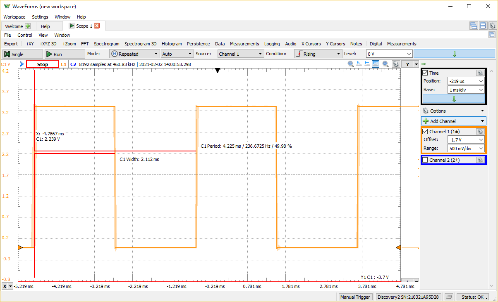
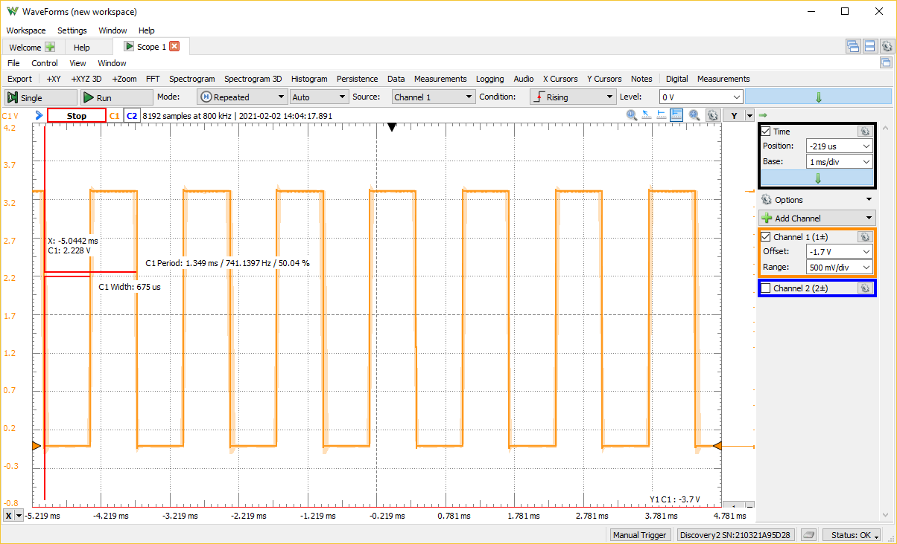

# Exam 1

Rock Boynton

EE 4930/011

02/02/2020

## 1. (50 pts.) Finite State Machine (FSM).

Implement your FSM of lab 4 using the alternate method of implementing FSMs (i.e., the lab used the Look Up Table (LUT) method, implement it using the nested if-else method). Start with a copy of your lab code and replace the LUT portion with an if-else implementation (or nested switch statements). Feel free to reuse the other parts of the code.

Submit a printout of your code, including any files you reuse from the lab code, into OneNote. Demo
the correct functionality on the MSP432 Launchpad.

### Solution

```c
// dehumidifier_fsm.h
#ifndef DEHUMIDIFIER_FSM_H_
#define DEHUMIDIFIER_FSM_H_

#include "msp.h"

typedef enum
{
	OFF,
	NORMAL_OPERATION,
	DEFROST,
    NUM_STATES
} State;

typedef enum
{
	HUMIDITY_RISE,
	HUMIDITY_FALL,
    ICE_SENSED,
    IDLE,
    NUM_EVENTS
} Event;

// function prototypes for state actions

/**
 * @brief Turn the fan and compressor on
 *
 */
void operate_normally(void);

/**
 * @brief Turn the fan and compressor off
 *
 */
void turn_off(void);

/**
 * @brief Turn the fan on and the compressor off
 *
 */
void defrost_coils(void);

/**
 * @brief Wraps the `__no_operation` for use in the state table
 *
 */
void no_op(void);

/**
 * @brief Run the appropriate state's action and return the next state
 *
 * @param current_state - current state of the system with action to run
 * @param input - current input event
 * @return State - next state
 */
State update_state(State current_state, Event input);

#endif // DEHUMIDIFIER_FSM_H_
```

```c
// dehumidifier_fsm.c
#include "dehumidifier_fsm.h"

/**
 * @brief Turn the fan and compressor on
 *
 */
void operate_normally(void)
{
    P5->OUT |= BIT0;
    P5->OUT |= BIT2;
}

/**
 * @brief Turn the fan and compressor off
 *
 */
void turn_off(void)
{
    P5->OUT &= ~BIT0;
    P5->OUT &= ~BIT2;
}

/**
 * @brief Turn the fan on and the compressor off
 *
 */
void defrost_coils(void)
{
    P5->OUT |= BIT0;
    P5->OUT &= ~BIT2;
}


void no_op(void)
{
    __no_operation();
}

State update_state(State current_state, Event input)
{
    State next_state;

    if (current_state == OFF)
    {
        if (input == HUMIDITY_RISE)
        {
            next_state = NORMAL_OPERATION;
            operate_normally();
        }
        else if (input == HUMIDITY_FALL)
        {
            next_state = OFF;
            no_op();
        }
        else if (input == ICE_SENSED)
        {
            next_state = DEFROST;
            defrost_coils();
        }
        else if (input == IDLE)
        {
            next_state = OFF;
            no_op();
        }
    }
    else if (current_state == NORMAL_OPERATION)
    {
        if (input == HUMIDITY_RISE)
        {
            next_state = NORMAL_OPERATION;
            no_op();
        }
        else if (input == HUMIDITY_FALL)
        {
            next_state = OFF;
            turn_off();
        }
        else if (input == ICE_SENSED)
        {
            next_state = DEFROST;
            defrost_coils();
        }
        else if (input == IDLE)
        {
            next_state = NORMAL_OPERATION;
            no_op();
        }
    }
    else if (current_state == DEFROST)
    {
        if (input == HUMIDITY_RISE)
        {
            next_state = NORMAL_OPERATION;
            operate_normally();
        }
        else if (input == HUMIDITY_FALL)
        {
            next_state = OFF;
            turn_off();
        }
        else if (input == ICE_SENSED)
        {
            next_state = DEFROST;
            no_op();
        }
        else if (input == IDLE)
        {
            next_state = OFF;
            turn_off();
        }
    }

    // return next state info
    return next_state;
}
```

```c
/*****************************************************************************
MSP432 main.c

Rock Boynton
01/21/2020
EE4930 Lab 4

Description:
    Provides the FSM control for a dehumidifier

*********   Bourns 3352T-1-103LF-10K potentiometer reference   ***************
Signal (Bourns 3352T)  LaunchPad pin
GND    (CCW,   pin 1)  ground
Wiper  (Wiper, pin 2)  connected to P4.7, 4.6
VCC    (CW,    pin 3)  power

*********   Nokia LCD interface reference   **********************************

Red SparkFun Nokia 5110 (LCD-10168)
-----------------------------------
Signal        (Nokia 5110) LaunchPad pin
3.3V          (VCC, pin 1) power
Ground        (GND, pin 2) ground
UCA3STE       (SCE, pin 3) connected to P9.4
Reset         (RST, pin 4) connected to P9.3
Data/Command  (D/C, pin 5) connected to P9.2
UCA3SIMO      (DN,  pin 6) connected to P9.7
UCA3CLK       (SCLK, pin 7) connected to P9.5
back light    (LED, pin 8) not connected
*****************************************************************************/
#include <stdio.h>
#include <stdlib.h>
#include <stdint.h>
#include <stdbool.h>

#include "msp.h"

#include "msoe_lib_clk.h"
#include "msoe_lib_lcd.h"
#include "msoe_lib_delay.h"

#include "dehumidifier_fsm.h"

// Defines
#define ADC_RANGE 256 // range of a 8-bit adc
#define HUMIDITY_SETPOINT_DEFAULT 50
#define HUMIDITY_SETPOINT_INC 5

typedef struct Input
{
    uint8_t val;
    const uint8_t lcd_x;
    const uint8_t lcd_y;
    bool changed;
} Input;

Input temp = {0, 9, 0, false};
Input humidity = {0, 9, 1, false};
Input humidity_setpoint = {0, 9, 2, false};
Input ice_sensed = {0, 11, 3, false};

/**
 * @brief Initialize the LCD
 *
 * Sets it up to display dehumidifier I/O
 *
 */
void init_lcd(void)
{
	LCD_Config();
	LCD_clear();
	LCD_home();
	LCD_contrast(10);

    LCD_print_str("Temp:");

	LCD_goto_xy(0, 1);
	LCD_print_str("Humidity:");

	LCD_goto_xy(0, 2);
	LCD_print_str("Setpt: ");

    LCD_goto_xy(0, 3);
	LCD_print_str("Ice:");
}

/**
 * @brief Initialize input pins
 *
 * Setpoint += 5    -- P1.1 (S1)
 * Setpoint -= 5    -- P1.4 (S2)
 * Defrost (On/Off) -- P1.6
 *
 */
void init_inputs(void)
{
    // P1.1 is pushbutton S1 -- setpoint + 5
	P1->DIR &= ~BIT1; // make input
	P1->OUT |= BIT1;  // set as pull up
	P1->IE |= BIT1; // enable interrupt

    // P1.4 is pushbutton S2 -- setpoint - 5
	P1->DIR &= ~BIT4; // make input
	P1->OUT |= BIT4;  // set as pull up
	P1->IE |= BIT4; // enable interrupt

    // pin P1.6 -- defrost
    P1->DIR &= ~BIT6; // make input
	P1->OUT |= BIT6;  // set as pull up
	P1->IE |= BIT6; // enable interrupt

	P1->IES |= BIT1 | BIT4 | BIT6; // falling edge

	NVIC->ISER[1] |= BIT3; // enable interrupt in NVIC
}

/**
 * @brief Initialize output pins
 *
 * Fan (On/Off)     -- P5.0
 * Defrost (On/Off) -- P5.2
 *
 */
void init_outputs(void)
{
    // pin P5.0 -- fan
    P5->DIR |= BIT0;   // configure as output
    P5->OUT &= ~BIT0;  // set output low to start

    // pin P5.2 -- conpressor
    P5->DIR |= BIT2;   // configure as output
    P5->OUT &= ~BIT2;  // set output low to start
}

/**
 * @brief Initialize GPIOs
 *
 * Set unused pins to pullup/down enabled to avoid floating inputs
 *
 */
void init_gpio(void)
{
    // set unused pins to pullup/down enabled to avoid floating inputs
    P1->REN |= 0xFF;
    P2->REN |= 0xFF;
    P3->REN |= 0xFF;
    P4->REN |= 0xFF;
    P5->REN |= 0xFF;
    P6->REN |= 0xFF;
    P7->REN |= 0xFF;
    P8->REN |= 0xFF;
    P9->REN |= 0xFF;
    P10->REN |= 0xFF;

    init_inputs();
    init_outputs();
}

void update_display(Input *input)
{
    if (input->changed)
    {
        LCD_goto_xy(input->lcd_x, input->lcd_y);
        if (input->lcd_y == 3) // defrost
            LCD_print_str(input->val ? "Y" : "N");
        else
            LCD_print_udec3(input->val);

        input->changed = false;
    }
}

/**
 * @brief Initialize analog-to-digital converters (ADC)
 *
 * Initializes the temperature (P4.7) and humidity control (P4.6)
 *
 */
void init_adc(void)
{
    P4->SEL0 |= BIT7 | BIT6; // set pins
    P4->SEL1 |= BIT7 | BIT6;  // set pins
	// Sampling time, S&H=96, ADC14 on, SMCLK, repeat sequence of channels
    ADC14->CTL0 &= 0x0;
	ADC14->CTL0 |= ADC14_CTL0_SHT0_5 | ADC14_CTL0_SHT1_5 | ADC14_CTL0_SHP | ADC14_CTL0_SSEL_4 | ADC14_CTL0_ON | ADC14_CTL0_CONSEQ_3;
    ADC14->CTL1 &= 0xF0000000;
	ADC14->CTL1 &= ~(ADC14_CTL1_RES_2 | ADC14_CTL1_RES_1); // 8-bit conversion
	ADC14->CTL1 |= (4 << ADC14_CTL1_CSTARTADD_OFS); // use MEM[4]
	ADC14->MCTL[4] |= ADC14_MCTLN_INCH_6;			// input on A6 - temperature
	ADC14->MCTL[5] |= ADC14_MCTLN_INCH_7;           // input on A7 - humidity
    ADC14->MCTL[5] |= BIT7;  // set EOS
	ADC14->IER0 |= ADC14_IER0_IE4 | ADC14_IER0_IE5;					// enable interrupts
	ADC14->CTL0 |= ADC14_CTL0_ENC;
	NVIC->ISER[0] |= ADC14_IER0_IE24; // enable ADC interrupt in NVIC
	ADC14->CTL0 |= 1; // start
}

/**
 * @brief Pushbutton interrupt handler
 *
 */
void PORT1_IRQHandler(void)
{
    uint16_t interrupt_flags = P1->IV;

    if (interrupt_flags == DIO_PORT_IV__IFG1 && humidity_setpoint.val < 100)
    { // P1.1 (S1) - raise humidity setpoint
        humidity_setpoint.val += HUMIDITY_SETPOINT_INC;
        humidity_setpoint.changed = true;
    }
    else if (interrupt_flags == DIO_PORT_IV__IFG4 && humidity_setpoint.val > 0)
    { // P1.4 (S2) - lower humidity setpoint
        humidity_setpoint.val -= HUMIDITY_SETPOINT_INC;
        humidity_setpoint.changed = true;
    }
    else if (interrupt_flags == DIO_PORT_IV__IFG6)
    { // P1.6 - Defrost jumper
        ice_sensed.val = P1->IN & BIT6;
        ice_sensed.changed = true;
    }
}

/**
 * @brief ADC interrupt handler
 *
 * Reads the value and updates the temperature
 *
 */
void ADC14_IRQHandler(void)
{
    uint32_t interrupt_flags = ADC14->IFGR0;
    uint16_t adc_reading;
    if (interrupt_flags & BIT4)
    {
        adc_reading = ADC14->MEM[4];
        // put temperature in range of 40 - 110
        temp.val = (((float) adc_reading) / ADC_RANGE) * (111 - 40) + 40;
        ADC14->CLRIFGR0 |= BIT4; // clear irq flag
        temp.changed = true;
    }
    else if (interrupt_flags & BIT5)
    {
        adc_reading = ADC14->MEM[5];
        // put humidity in range of 0 - 100
        humidity.val = (((float) adc_reading) / ADC_RANGE) * 101;
        ADC14->CLRIFGR0 |= BIT5; // clear irq flag
        humidity.changed = true;
    }
    ADC14->CLRIFGR0 |= 0xFFFFFFFF; // precaution
}

void main(void)
{
	WDT_A->CTL = WDT_A_CTL_PW | WDT_A_CTL_HOLD;		// stop watchdog timer
    Clock_Init_48MHz(); // run system at 48MHz (default is 3MHz)

    // setup
	init_gpio();
	init_adc();
	init_lcd();

	__enable_interrupts(); // global interrupt enable

	State current_state = OFF; // start in OFF state
	Event input_event;
    humidity_setpoint.val = HUMIDITY_SETPOINT_DEFAULT; // default set point
    humidity_setpoint.changed = true;

    while (1)
	{
       __disable_interrupts(); // entering critical section

        update_display(&temp);
        update_display(&humidity);
        update_display(&humidity_setpoint);
        update_display(&ice_sensed);

		// read inputs
        ADC14->CTL0 |= 1; // start adc conversions
	    if (!ice_sensed.val && humidity.val >= humidity_setpoint.val + 5) {
            input_event = HUMIDITY_RISE;
        } else if (!ice_sensed.val && humidity.val <= humidity_setpoint.val - 5) {
            input_event = HUMIDITY_FALL;
        } else if (ice_sensed.val) {
            input_event = ICE_SENSED;
        } else if (!ice_sensed.val) {
            input_event = IDLE;
        }

		current_state = update_state(current_state, input_event);

       __enable_interrupts(); // leaving critical section
	}
}

```

## 2. (50 pts.) Optimization.

Optimize the following code for speed (by hand). Submit a printout of your modified code into OneNote. Reference the line numbers from the original file for each part that you modify. Include comments to indicate what you did and how you expect it to improve the execution speed. The intent is for you to apply as many of the techniques we discussed in class, not just to get the absolute fastest time, hence, do not reduce the code to something trivial. Also indicate the run-time of the while(1) loop, both the original code, and after your optimizations.

### Solution

The following optimizations made the code run ~213% faster while still performing the same tasks as
the original code. I didn't reference actual line numbers from the original as there were many, many
changes scattered about, but it should be easy to follow what/why I changed from my comments.

```c
//*****************************************************************************
//
// EE4930_exam1_p2.c
// 1/22/2021
//
// Optimize the following code for speed.
// Reference the line numbers of the code you change in each section of your solution
// Include comments to indicate what you did and how it improves execution speed
//
// Modified by Rock Boynton
//****************************************************************************
#include "msp.h"

void init_A2D(void);
void main(void)
{
    WDTCTL = WDTPW | WDTHOLD; // Stop watchdog timer

    // setup port pin for scope timing
    P3->DIR |= BIT6;
    P3->OUT &= ~BIT6;
    init_A2D();

    // remove unecessary variables
    int arr[4], arr1[100], alpha[4], omega[4];
    int i;
    int y, k, beta, gamma, sum = 0;


    while (1)
    {
        beta = ADC14->MEM[0];
        for (i = 0; i < 4; i++)
        {
            // Do stuff in the same loop rather than seperate loops
            alpha[i] = beta * i;
            arr[i] = gamma + (1 << i); // power with base 2 is left shift operation
            omega[i] = alpha[i] + arr[3 - i];
        }

        gamma = beta * beta * beta * beta; // unroll multiplication rather than use power function

    // perform static calculation by hand, saves multiplication
    // x = 2;
    // y = x * 31; // 62
    y = 62;
    // z = (y + 3) * 4 - (x + 12); // 246
    // x = y + z; // 308
    // let k = 33 * x = 10164, pulling out calculation from loop
    k = 10164;
    for (i = 0; i < 100; i += 10) // partially unroll large loop...could unroll further
    {
        // replace mod with equivalent power-of-2 bitwise op (x % 2^n == x & (2^n-1))
        // replace unchanging variables with calculated literals
        arr1[i] = k + (y * i) - omega[i & 3];
        arr1[i + 1] = k + (y * (i + 1)) - omega[(i + 1) & 3];
        arr1[i + 2] = k + (y * (i + 2)) - omega[(i + 2) & 3];
        arr1[i + 3] = k + (y * (i + 3)) - omega[(i + 3) & 3];
        arr1[i + 4] = k + (y * (i + 4)) - omega[(i + 4) & 3];
        arr1[i + 5] = k + (y * (i + 5)) - omega[(i + 5) & 3];
        arr1[i + 6] = k + (y * (i + 6)) - omega[(i + 6) & 3];
        arr1[i + 7] = k + (y * (i + 7)) - omega[(i + 7) & 3];
        arr1[i + 8] = k + (y * (i + 8)) - omega[(i + 8) & 3];
        arr1[i + 9] = k + (y * (i + 9)) - omega[(i + 9) & 3];
        }

        // unroll mod 9 loop into single expression, no loop needed
        sum += arr1[0] + arr1[9] + arr1[18] + arr1[27] + arr1[36] + arr1[45] + arr1[54] + arr1[63]
               + arr1[72] + arr1[81] + arr1[90] + arr1[99];

        P3->OUT ^= BIT6; //toggle for timing measurement
    }
}

// remove power function (not needed)

void init_A2D(void)
{
    // Sampling time, S&H=96, ADC14 on, ACLK
    // * CHANGED Set all bits in a single statement, saves a register read-modify-write
    ADC14->CTL0 |= ADC14_CTL0_SHT0_5 | ADC14_CTL0_SHP | ADC14_CTL0_SSEL_3 | ADC14_CTL0_CONSEQ_2 | ADC14_CTL0_ON | ADC14_CTL0_MSC;
    // ADC14->CTL0 |= ADC14_CTL0_CONSEQ_2 | ADC14_CTL0_ON | ADC14_CTL0_MSC;
    ADC14->MCTL[0] |= ADC14_MCTLN_INCH_6; // input on A6

    P4->SEL0 |= 0x80; // use A/D
    P4->SEL1 |= 0x80;
    ADC14->CTL0 |= ADC14_CTL0_ENC | ADC14_CTL0_SC;

    return;
}
```




