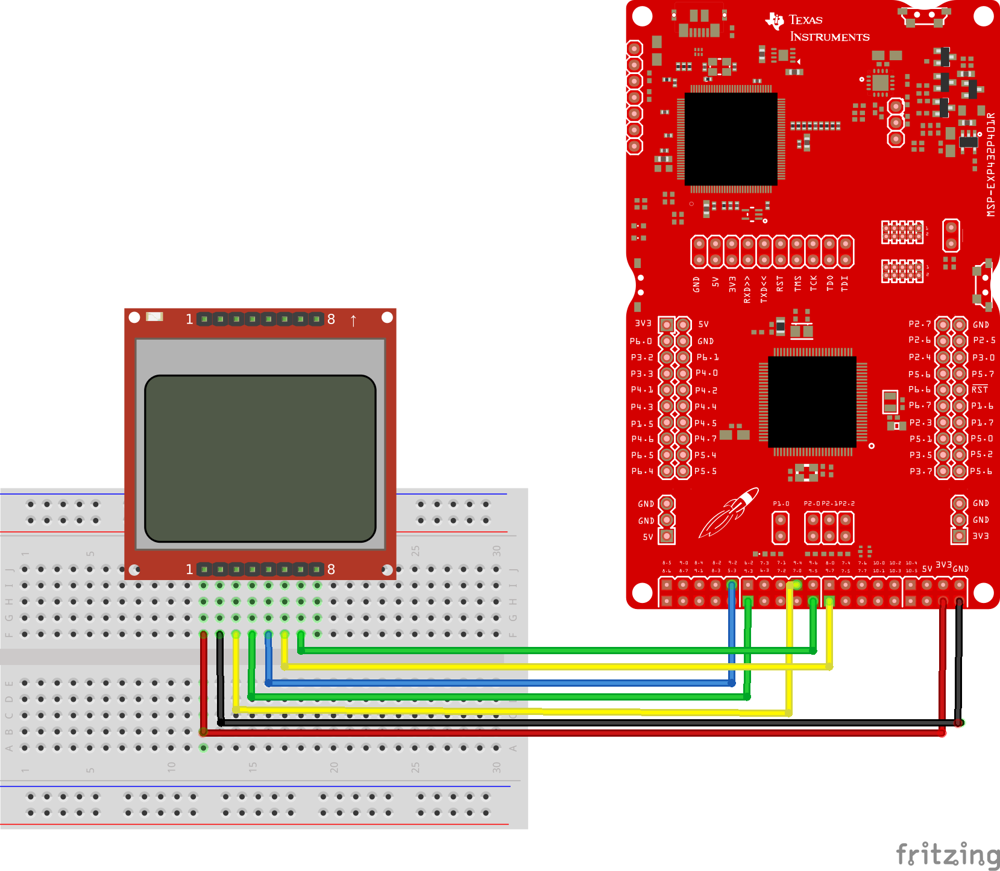

# LAB1 – TOOL TIME

Rock Boynton

EE 4930/011

12/07/2020

## Objectives

The objective of this lab is to become familiar with the Code Composer
Studio development environment and gain some experience with the MSP32
including using it to interface with an LCD display and set GPIO pins
connected to things like a pushbutton and an LED. The purpose of this
lab also included learning how to use the provide MSOE libraries for the
more complex peripherals like the LCD.

## Description

This lab consists of wiring up the LCD to the MSP432 LaunchPad
development board, as dictated by the MSOE LCD library, then writing a C
program to print the text "EE4930" and then repeatedly do the following:

Read the state of a pushbutton switch connected to one of the GPIO
inputs.

-   If the pushbutton is not pressed:

    -   turn off an LED connected to one of the GPIO pins. Also, on the
        LCD display, write the following text on the second and third
        lines:

        > OFF
        >
        > First name

-   Where 'First name' is replaced with the first 12 letters of my first
    name, i.e., "Rock."

-   Blanks the fourth line, so that if there was text there, it will
    disappear.


-   If the pushbutton is pressed:

    -   turn on the LED. Also, on the LCD display, write the following
        text on the second and fourth lines:

        > ON
        >
        > Last name

-   Where 'Last name' is replaced with the first 12 letters of my last
    name, i.e., "Boynton."

-   Blanks the fourth line, so that if there was text there, it will
    disappear.

The text displayed on the first line of the LCD is written there once,
and only once. It is not re-written every time I change other lines on
the LCD.

Some functions you can use for interfacing to the display are located in
the MSOE_LIB library.

## Conclusions

This lab was a really nice introduction to the TI development platform
and using Code Composer Studio (CCS) as well as got me familiar with
using the LCD and GPIO of the MSP432. I was able to find all of the
resources I needed, but they were in a variety of places and mediums,
including webpages, PowerPoints, and datasheets.

## Source Code

```c
/*****************************************************************************
MSP432 main.c

Rock Boynton
12/07/2020
EE4930 Lab 1

Print "EE4930" to the first line of the LCD display
On the next 2 lines of the LCD, read pushbutton S1:
if off, turn off an LED and print
    OFF
    Rock
else on, turn on an LED and print
    ON
    Boynton

*********   Nokia LCD interface reference   **************

Red SparkFun Nokia 5110 (LCD-10168)
-----------------------------------
Signal        (Nokia 5110) LaunchPad pin
3.3V          (VCC, pin 1) power
Ground        (GND, pin 2) ground
UCA3STE       (SCE, pin 3) connected to P9.4
Reset         (RST, pin 4) connected to P9.3
Data/Command  (D/C, pin 5) connected to P9.2
UCA3SIMO      (DN,  pin 6) connected to P9.7
UCA3CLK       (SCLK, pin 7) connected to P9.5
back light    (LED, pin 8) not connected

*****************************************************************************/

#include <stdint.h>
#include "msp.h"
#include "msoe_lib_clk.h"
#include "msoe_lib_lcd.h"

/**
 * @brief Initialize GPIOs
 *
 * Set unused pins to pullup/down enabled to avoid floating inputs,
 * initialize port P1.1 GPIO IN for pushbutton, and
 * initialize port 1.0 GPIO OUT for led
 *
 */
void init_gpio(void);

int main(void)
{
  WDTCTL = WDTPW | WDTHOLD; // stop watchdog timer
  Clock_Init_48MHz(); // run system at 48MHz (default is 3MHz)

  // setup
  init_gpio();
  LCD_Config();
  LCD_clear();
  LCD_home();
  LCD_contrast(10);

  LCD_print_str("EE4930");

  while(1){
      uint8_t pushbutton = P1->IN & BIT1;

      if(pushbutton){ // not pressed
          P1->OUT &= ~BIT0; // turn led off

          //print to lcd
          LCD_goto_xy(0,1);
          LCD_print_str("OFF         ");
          LCD_goto_xy(0,2);
          LCD_print_str("Rock        ");

          // blank the 4th line
          LCD_goto_xy(0,4);
          LCD_print_str("            ");
      } else { // pressed
          P1->OUT |= BIT0; // led on

          //print to lcd
          LCD_goto_xy(0,1);
          LCD_print_str("ON          ");
          LCD_goto_xy(0,2);
          LCD_print_str("Boynton     ");

          // blank the 3rd line
          LCD_goto_xy(0,3);
          LCD_print_str("            ");
      }
  }
}

void init_gpio(void)
{
    // set unused pins to pullup/down enabled to avoid floating inputs
    P1 ->REN |= 0xFF;
    P2 ->REN |= 0xFF;
    P3 ->REN |= 0xFF;
    P4 ->REN |= 0xFF;
    P5 ->REN |= 0xFF;
    P6 ->REN |= 0xFF;
    P7 ->REN |= 0xFF;
    P8 ->REN |= 0xFF;
    P9 ->REN |= 0xFF;
    P10->REN |= 0xFF;

    // P1.0 is LED1
    P1->DIR |=  BIT0; // make output
    P1->OUT &= ~BIT0; // set as pull down

    // P1.1 is pushbutton S1
    P1->DIR &= ~BIT1;  // make input
    P1->OUT |=  BIT1;  // set as pull up
}
```

## Wiring Diagram


