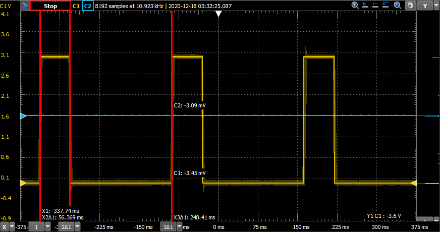
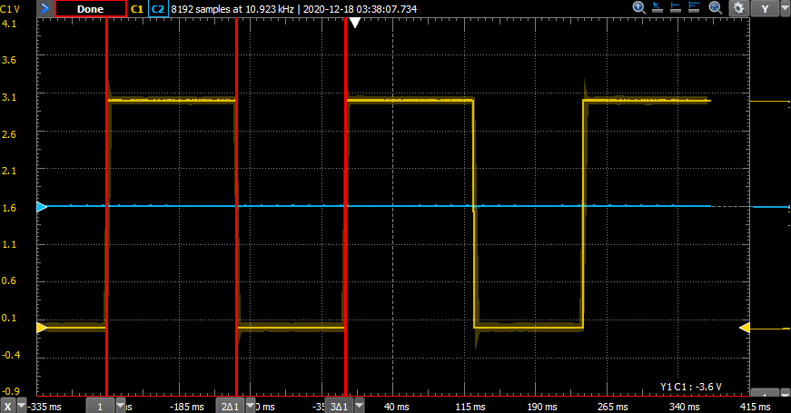
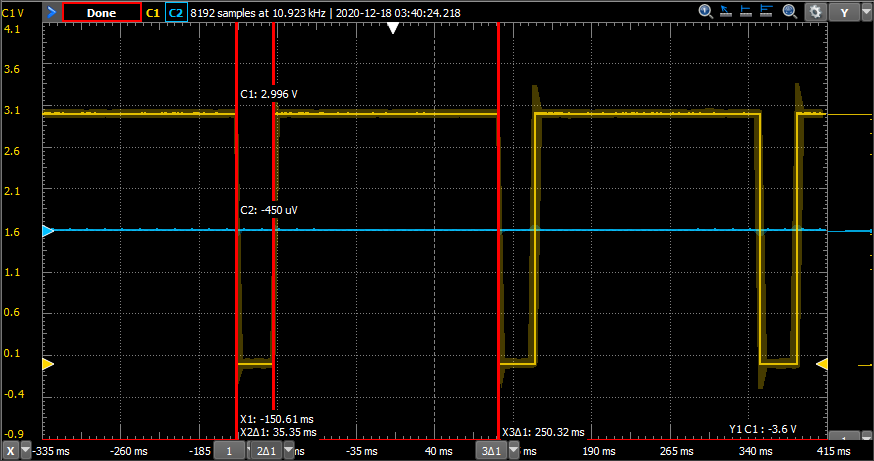
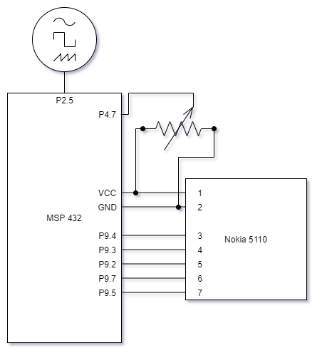
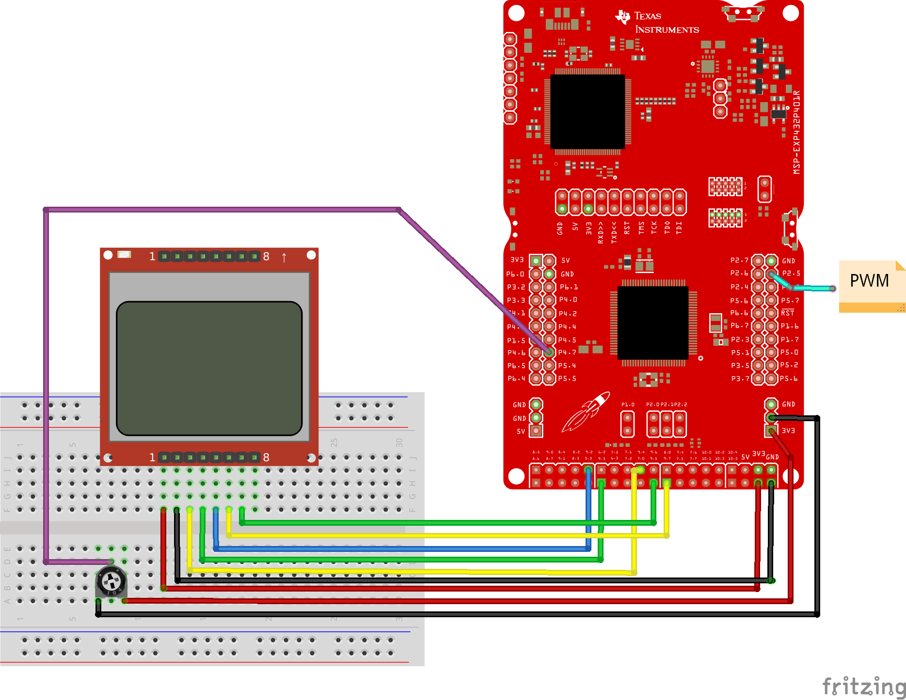

# LAB2 – MSP432

Rock Boynton

EE 4930/011

12/17/2020

## Objectives

The objective of this lab is to become familiar and gain some experience with
more of the MSP32's peripherals including a timer, an ADC (reading from a
potentiometer), and PWM signal generation. Then building upon what we learned
last week, display the values on an LCD screen.

This lab also gets us familiar with using interrupts for different functions
including capturing a pushbutton press, periodically triggering an ADC conversion
with a timer, and actually capture the A/D conversion value using an interrupt.

## Description

This laboratory consists of interfacing the MSP432 to the LCD, an analog input
signal, and generating a PWM output.

Specifications:

* Connect a potentiometer to 3.3V and ground, and connect its wiper terminal to
  an analog input on the MSP432.

* Perform Analog-to-Digital (A/D) conversions on this analog input with the
  following specs:

  * ‘single-channel single-conversion’ mode
  * 8-bit resolution.
  * A timer and its interrupt to periodically initiate a new A/D conversion.
    * The period used was 10Hz, because it allows for fast enough conversions
      to seem almost real time to a human, but efficient for the
      microcontroller**. A higher frequency is unnecessary for this exercise
      since the action of turning the potentiometer is a slow mechanical
      process, so 10Hz should be enough to keep up in this case.
  * A/D interrupt to handle getting the new conversion value when it is done.

* A/D reading is treated as a percentage. A timer generates a PWM signal with a
  duty cycle corresponding to this percentage but inverted, i.e., if the input
  is at 20%, the duty cycle is 80%, if at 70%, the duty cycle is 30%, etc.

* On the LCD, the A/D reading and the calculated duty cycle of the PWM signal
  are displayed. The LCD only updates with new values when SW1 is pressed. Use an
  interrupt with P1.1 to initiate this action. Do not call the LCD functions
  within the ISR.

## Scope Measurements to Verify Signal

I chose a couple positions at random. See demo video for further verification.

I used a 4Hz timer for the PWM signal and that is verified with the period being
approximately 250ms.







## Conclusions

This was a pretty challenging lab. Going through the code in lecture is helpful,
but it is much different from sitting down and writing it up. It took me a long
while to wrap my head around each of bits that needed to be set/cleared and why
in order to get each component (TimerA0, TimerA1, ADC14, pushbutton) working
and functioning properly. One thing I particularly found challenging was getting
the appropriate values to set for the Timers and actually running through the
calculation.

The example code provided a good starting point, but what really helped me was
breaking the task down into each of its parts and testing to make sure
the individual components were working.

Another thing I'd like to note is that I had pesky silent overflow errors
regarding printing with the `LCD_print_dec3` instead of `LCD_print_udec3`.

## Source Code

```c
/*****************************************************************************
MSP432 main.c

Rock Boynton
12/17/2020
EE4930 Lab 1

Description:
    Reads from a potentiometer with an ADC on SW1 press. Outputs a PWM signal
    on P2.5 with duty cycle inverted to ADC reading. ADC reading is
    periodically taken using another timer.

*********   Bourns 3352T-1-103LF-10K potentiometer reference   ***************
Signal (Bourns 3352T)  LaunchPad pin
GND    (CCW,   pin 1)  ground
Wiper  (Wiper, pin 2)  connected to P4.7
VCC    (CW,    pin 3)  power

*********   Nokia LCD interface reference   **********************************

Red SparkFun Nokia 5110 (LCD-10168)
-----------------------------------
Signal        (Nokia 5110) LaunchPad pin
3.3V          (VCC, pin 1) power
Ground        (GND, pin 2) ground
UCA3STE       (SCE, pin 3) connected to P9.4
Reset         (RST, pin 4) connected to P9.3
Data/Command  (D/C, pin 5) connected to P9.2
UCA3SIMO      (DN,  pin 6) connected to P9.7
UCA3CLK       (SCLK, pin 7) connected to P9.5
back light    (LED, pin 8) not connected

*****************************************************************************/

#include <stdint.h>
#include <stdbool.h>
#include "msp.h"
#include "msoe_lib_clk.h"
#include "msoe_lib_lcd.h"

// Defines
#define INT_ADC14_BIT (1 << 24)
#define PWM_PER 46903 // TOP value for timer at 4 Hz
#define ADC_RANGE 256 // range of a 8-bit adc
#define TEN_HZ_PSC 18750

// Global variables
bool pushbutton_is_pressed = false;
uint16_t adc_reading = 0;
uint8_t pwm_duty_cycle = 0;

/**
 * @brief Initialize GPIOs
 *
 * Set unused pins to pullup/down enabled to avoid floating inputs,
 * initialize port P1.1 GPIO IN for pushbutton, enable interrupts
 *
 */
void init_gpio(void)
{
    // set unused pins to pullup/down enabled to avoid floating inputs
    P1->REN |= 0xFF;
    P2->REN |= 0xFF;
    P3->REN |= 0xFF;
    P4->REN |= 0xFF;
    P5->REN |= 0xFF;
    P6->REN |= 0xFF;
    P7->REN |= 0xFF;
    P8->REN |= 0xFF;
    P9->REN |= 0xFF;
    P10->REN |= 0xFF;

    // P1.1 is pushbutton S1
    P1->DIR &= ~BIT1; // make input
    P1->OUT |= BIT1;  // set as pull up
    P1->IE |= BIT1; // enable interrupt
    P1->IES |= BIT0; // falling edge
    NVIC->ISER[1] |= BIT3; // enable interrupt in NVIC
}

/**
 * @brief Initialize analog-to-digital converter (ADC)
 *
 */
void init_adc(void)
{
    // Sampling time, S&H=96, ADC14 on, SMCLK, single input, single conv.
    ADC14->CTL0 |= ADC14_CTL0_SHT0_5 | ADC14_CTL0_SHP | ADC14_CTL0_SSEL_4 | ADC14_CTL0_ON;
    ADC14->CTL1 &= ~(ADC14_CTL1_RES_2 | ADC14_CTL1_RES_1); // 8-bit conversion
    ADC14->CTL1 |= (4 << ADC14_CTL1_CSTARTADD_OFS); // use MEM[4]
    ADC14->MCTL[4] |= ADC14_MCTLN_INCH_6;			// input on A6
    ADC14->IER0 |= ADC14_IER0_IE4;					// enable interrupt
    ADC14->CTL0 |= ADC14_CTL0_ENC;
    NVIC->ISER[0] |= INT_ADC14_BIT; // enable ADC interrupt in NVIC

    P4->SEL1 |= BIT7;  // give A/D control of pin - A6
    P4->SEL0 |= BIT7;
}

/**
 * @brief Initialize pulse-width modulation (PWM)
 *
 */
void init_pwm(void)
{
    // use SMCLK, UP mode, interrupt enabled, prescale 8 x 8 = 64
    TIMER_A0->CTL |= TIMER_A_CTL_SSEL__SMCLK | TIMER_A_CTL_MC__UP |
                     TIMER_A_CTL_CLR | TIMER_A_CTL_IE | TIMER_A_CTL_ID__8;
    TIMER_A0->CCTL[2] |= TIMER_A_CCTLN_OUTMOD_7; // Reset/set output mode
    TIMER_A0->CCR[0] = PWM_PER;
    TIMER_A0->EX0 |= TIMER_A_EX0_IDEX__8; // factor of 8
    NVIC->ISER[0] |= BIT9; // enable TA0_N interrupt

    P2->SEL0 |= BIT5; // give timer control of pin 2.5
    P2->SEL1 &= ~BIT5;
    P2->DIR |= BIT5; // make output

}

/**
 * @brief initialize timer for periodic interrupts
 *
 * Triggers the ADC to start a conversion
 */
void init_periodic_timer(void)
{
    // Configure TimA1 to SMCLOCK (12 MHz using 48MHz system clock), divide by 8,  UP mode, Interrupt Enable
    TIMER_A1->CTL |= TIMER_A_CTL_SSEL__SMCLK | TIMER_A_CTL_ID__8 | TIMER_A_CTL_MC__UP
                     | TIMER_A_CTL_IE | TIMER_A_CTL_CLR;
    TIMER_A1->EX0 |= TIMER_A_EX0_IDEX__8; // divide by 8 again, giving a timer freq of 187.5KHz
    TIMER_A1->CCR[0] = TEN_HZ_PSC;  // set frequency as 10 Hz
    NVIC->ISER[0] |= BITB;  // enable TA1_N interrupt
}

/**
 * @brief Initialize the LCD
 *
 */
void init_lcd(void)
{
    LCD_Config();
    LCD_clear();
    LCD_home();
    LCD_contrast(10);
}

/**
 * @brief Pushbutton interrupt handler
 *
 */
void PORT1_IRQHandler(void)
{
    uint16_t dummy = P1->IV; // clear flag
    pushbutton_is_pressed = true;
}

/**
 * @brief PWM timer interrupt handler
 */
void TA0_N_IRQHandler(void)
{
    uint16_t dummy = TIMER_A0->IV; // clear flag
}

/**
 * @brief Periodic timer interrupt
 *
 * Triggers ADC conversion
 *
 */
void TA1_N_IRQHandler(void)
{
    uint16_t dummy = TIMER_A1->IV; // clear flag
    ADC14->CTL0 |= ADC14_CTL0_SC; // start a new ADC conversion
}

/**
 * @brief ADC interrupt handler
 *
 * Reads the value and updates the duty cycle
 *
 */
void ADC14_IRQHandler(void)
{
    adc_reading = ADC14->MEM[4];
    pwm_duty_cycle = 100 - ((((float) adc_reading) / ADC_RANGE) * 100);
    TIMER_A0->CCR[2] = (PWM_PER * pwm_duty_cycle) / 100;
}

int main(void)
{
    WDTCTL = WDTPW | WDTHOLD;; // stop watchdog timer
    Clock_Init_48MHz();	// run system at 48MHz (default is 3MHz)

    // setup
    init_gpio();
    init_adc();
    init_pwm();
    init_periodic_timer();
    init_lcd();

    __enable_interrupts(); // global interrupt enable

    LCD_print_str("ADC reading:");

    LCD_goto_xy(0, 2);
    LCD_print_str("Duty Cycle: ");

    LCD_goto_xy(4, 3);
    LCD_print_str("%");

    while (1)
    {
        if (pushbutton_is_pressed)
        {
            __disable_interrupts(); // entering critical section

            LCD_goto_xy(1, 1);
            LCD_print_udec3(adc_reading);

            LCD_goto_xy(1, 3);
            LCD_print_udec3(pwm_duty_cycle);

            pushbutton_is_pressed = false;

            __enable_interrupts(); // leaving critical section
        }
    }
}
```

## Schematic & Wiring Diagrams




