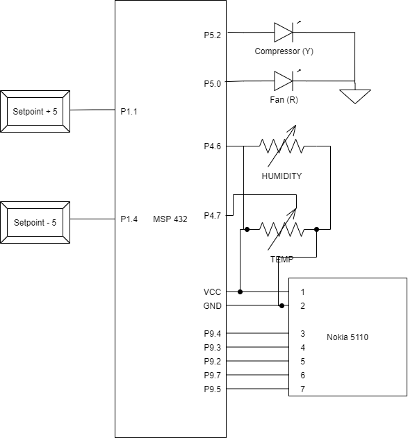

# LAB4 – Humidifier FSM

Rock Boynton

EE 4930/011

01/21/2020

## Objectives

The objective of this lab is to write code implementing a Finite State Machine (FSM) using the
Look Up Table (LUT) method, which uses function pointers as a mechanism of implementation.

This lab has us implement a more complex system that actually models a real world embedded system.

## Description

This lab implements a FSM as the control for a dehumidifier. A dehumidifier removes moisture from
the air with a compressor to cool coils which have the moisture collect through condensation. A fan
blows air through the coils to circulate the air.

Specifications:

* Inputs:
  * Room temperature – potentiometer (40 – 110 deg. F)
  * Humidity – potentiometer (0 – 100% RH)
  * Humidity setpoint – two push button switches (up, down)
  * Ice sensor – yes/no (switch or jumper)
* Outputs:
  * Fan control – ON/OFF
  * Compressor – ON/OFF
  * LCD
    * Temperature
    * Setpoint
    * Humidity
    * Defrost
* The setpoint adjustment should be in increments of 5% relative humidity
* If the humidity sensor reading is greater than the setpoint by at least 5, and if the ice sensor does not sense ice, then turn on the fan and compressor. Leave them on until the humidity reading drops below the setpoint by at least 5.
* If the humidity reading is at least 5 less than the setpoint, and if the ice sensor does not sense ice, turn off the compressor and the fan. Leave them off until the humidity reading goes above the setpoint by at least 5.
* If the humidity sensor reading is within 5 of the setpoint, then there should be no change in the outputs, i.e., if the reading came into this setpoint band from below, the outputs should remain off, if it came into it from above, the outputs should remain on. (hysteresis)
* If there is ice, then turn on the fan (but not the compressor) (Defrost mode). When the ice is gone, return to normal operation, but only turn the compressor on if the humidity sensor reading is at least 5 above the setpoint.

## Conclusion

I enjoyed this lab a lot. I felt like I was building something that has a real application which was
very cool. And we only had two weeks to complete, I wonder how much more time would need to be
invested for an actual production dehumidifier control unit.

Controlling the potentiometers was something we've done before, but distinguishing between multiple
interrupts on the same port (withing the same IRQ handler was something new. Similarly, I had to distinguish between multiple interrupts for
pushbuttons, and I initially had trouble finding the difference between the PxIV and the PxIFG
register and getting the right interrupt, but eventually got it.

As far as the FSM itself, it's one of my favorite applications of the C language with using function
pointers and enumerations... I just find it a really elegant solution to a common design problem. I
actually implementing a locking system in my CE embedded 2 class using this method, so I had a
little experience with it. It took me a little bit of thinking to design the system appropriately,
and to my surprise it *almost* worked perfectly the first try.

I say almost because I actually still have an issue when coming out of defrost...it doesn't turn on
the compressor if the humidity is > setpoint + 5. I am open to hearing why you think that is or what
I should look for.

## Source Code

```c
// dehumidifier_fsm.h
#ifndef DEHUMIDIFIER_FSM_H_
#define DEHUMIDIFIER_FSM_H_

#include "msp.h"

typedef enum
{
	OFF,
	NORMAL_OPERATION,
	DEFROST,
    NUM_STATES
} State;

typedef enum
{
	HUMIDITY_RISE,
	HUMIDITY_FALL,
    ICE_SENSED,
    IDLE,
    NUM_EVENTS
} Event;

typedef void (*function_ptr)(void);

typedef struct {
    State next_state;
    function_ptr action;
} state_element;

// function prototypes for state actions

/**
 * @brief Turn the fan and compressor on
 *
 */
void operate_normally(void);

/**
 * @brief Turn the fan and compressor off
 *
 */
void turn_off(void);

/**
 * @brief Turn the fan on and the compressor off
 *
 */
void defrost_coils(void);

/**
 * @brief Wraps the `__no_operation` for use in the state table
 *
 */
void no_op(void);

//void __no_operation();

// state table array
extern state_element state_table[NUM_STATES][NUM_EVENTS];

/**
 * @brief Run the appropriate state's action and return the next state
 *
 * @param current_state - current state of the system with action to run
 * @param input - current input event
 * @return State - next state
 */
State update_state(State current_state, Event input);

#endif // DEHUMIDIFIER_FSM_H_

```

---

```c
// dehumidifier_fsm.c
#include "dehumidifier_fsm.h"

/**
 * @brief Turn the fan and compressor on
 *
 */
void operate_normally(void)
{
    P5->OUT |= BIT0;
    P5->OUT |= BIT2;
}

/**
 * @brief Turn the fan and compressor off
 *
 */
void turn_off(void)
{
    P5->OUT &= ~BIT0;
    P5->OUT &= ~BIT2;
}

/**
 * @brief Turn the fan on and the compressor off
 *
 */
void defrost_coils(void)
{
    P5->OUT |= BIT0;
    P5->OUT &= ~BIT2;
}


void no_op(void)
{
    __no_operation();
}

// create state table array
state_element state_table[NUM_STATES][NUM_EVENTS] = {
    {{NORMAL_OPERATION, operate_normally}, {OFF, no_op}, {DEFROST, defrost_coils}, {OFF, no_op}},
    {{NORMAL_OPERATION, no_op}, {OFF, turn_off}, {DEFROST, defrost_coils}, {NORMAL_OPERATION, no_op}},
    {{DEFROST, no_op}, {DEFROST, no_op}, {DEFROST, no_op}, {OFF, turn_off}}
};

State update_state(State current_state, Event input)
{
    state_element current = state_table[current_state][input];

    // run the proper action function
    (*current.action)();

    // return next state info
    return current.next_state;
}

```

---


```c
/*****************************************************************************
MSP432 main.c

Rock Boynton
01/21/2020
EE4930 Lab 4

Description:
    Provides the FSM control for a dehumidifier

*********   Bourns 3352T-1-103LF-10K potentiometer reference   ***************
Signal (Bourns 3352T)  LaunchPad pin
GND    (CCW,   pin 1)  ground
Wiper  (Wiper, pin 2)  connected to P4.7, 4.6
VCC    (CW,    pin 3)  power

*********   Nokia LCD interface reference   **********************************

Red SparkFun Nokia 5110 (LCD-10168)
-----------------------------------
Signal        (Nokia 5110) LaunchPad pin
3.3V          (VCC, pin 1) power
Ground        (GND, pin 2) ground
UCA3STE       (SCE, pin 3) connected to P9.4
Reset         (RST, pin 4) connected to P9.3
Data/Command  (D/C, pin 5) connected to P9.2
UCA3SIMO      (DN,  pin 6) connected to P9.7
UCA3CLK       (SCLK, pin 7) connected to P9.5
back light    (LED, pin 8) not connected
*****************************************************************************/
#include <stdio.h>
#include <stdlib.h>
#include <stdint.h>
#include <stdbool.h>

#include "msp.h"

#include "msoe_lib_clk.h"
#include "msoe_lib_lcd.h"
#include "msoe_lib_delay.h"

#include "dehumidifier_fsm.h"

// Defines
#define ADC_RANGE 256 // range of a 8-bit adc
#define HUMIDITY_SETPOINT_DEFAULT 50
#define HUMIDITY_SETPOINT_INC 5

typedef struct Input
{
    uint8_t val;
    const uint8_t lcd_x;
    const uint8_t lcd_y;
    bool changed;
} Input;

Input temp = {0, 9, 0, false};
Input humidity = {0, 9, 1, false};
Input humidity_setpoint = {0, 9, 2, false};
Input ice_sensed = {0, 11, 3, false};

/**
 * @brief Initialize the LCD
 *
 * Sets it up to display dehumidifier I/O
 *
 */
void init_lcd(void)
{
	LCD_Config();
	LCD_clear();
	LCD_home();
	LCD_contrast(10);

    LCD_print_str("Temp:");

	LCD_goto_xy(0, 1);
	LCD_print_str("Humidity:");

	LCD_goto_xy(0, 2);
	LCD_print_str("Setpt: ");

    LCD_goto_xy(0, 3);
	LCD_print_str("Ice:");
}

/**
 * @brief Initialize input pins
 *
 * Setpoint += 5    -- P1.1 (S1)
 * Setpoint -= 5    -- P1.4 (S2)
 * Defrost (On/Off) -- P1.6
 *
 */
void init_inputs(void)
{
    // P1.1 is pushbutton S1 -- setpoint + 5
	P1->DIR &= ~BIT1; // make input
	P1->OUT |= BIT1;  // set as pull up
	P1->IE |= BIT1; // enable interrupt

    // P1.4 is pushbutton S2 -- setpoint - 5
	P1->DIR &= ~BIT4; // make input
	P1->OUT |= BIT4;  // set as pull up
	P1->IE |= BIT4; // enable interrupt

    // pin P1.6 -- defrost
    P1->DIR &= ~BIT6; // make input
	P1->OUT |= BIT6;  // set as pull up
	P1->IE |= BIT6; // enable interrupt

	P1->IES |= BIT1 | BIT4 | BIT6; // falling edge

	NVIC->ISER[1] |= BIT3; // enable interrupt in NVIC
}

/**
 * @brief Initialize output pins
 *
 * Fan (On/Off)     -- P5.0
 * Defrost (On/Off) -- P5.2
 *
 */
void init_outputs(void)
{
    // pin P5.0 -- fan
    P5->DIR |= BIT0;   // configure as output
    P5->OUT &= ~BIT0;  // set output low to start

    // pin P5.2 -- conpressor
    P5->DIR |= BIT2;   // configure as output
    P5->OUT &= ~BIT2;  // set output low to start
}

/**
 * @brief Initialize GPIOs
 *
 * Set unused pins to pullup/down enabled to avoid floating inputs
 *
 */
void init_gpio(void)
{
    // set unused pins to pullup/down enabled to avoid floating inputs
    P1->REN |= 0xFF;
    P2->REN |= 0xFF;
    P3->REN |= 0xFF;
    P4->REN |= 0xFF;
    P5->REN |= 0xFF;
    P6->REN |= 0xFF;
    P7->REN |= 0xFF;
    P8->REN |= 0xFF;
    P9->REN |= 0xFF;
    P10->REN |= 0xFF;

    init_inputs();
    init_outputs();
}

void update_display(Input *input)
{
    if (input->changed)
    {
        LCD_goto_xy(input->lcd_x, input->lcd_y);
        if (input->lcd_y == 3) // defrost
            LCD_print_str(input->val ? "Y" : "N");
        else
            LCD_print_udec3(input->val);

        input->changed = false;
    }
}

/**
 * @brief Initialize analog-to-digital converters (ADC)
 *
 * Initializes the temperature (P4.7) and humidity control (P4.6)
 *
 */
void init_adc(void)
{
    P4->SEL0 |= BIT7 | BIT6; // set pins
    P4->SEL1 |= BIT7 | BIT6;  // set pins
	// Sampling time, S&H=96, ADC14 on, SMCLK, repeat sequence of channels
    ADC14->CTL0 &= 0x0;
	ADC14->CTL0 |= ADC14_CTL0_SHT0_5 | ADC14_CTL0_SHT1_5 | ADC14_CTL0_SHP | ADC14_CTL0_SSEL_4 | ADC14_CTL0_ON | ADC14_CTL0_CONSEQ_3;
    ADC14->CTL1 &= 0xF0000000;
	ADC14->CTL1 &= ~(ADC14_CTL1_RES_2 | ADC14_CTL1_RES_1); // 8-bit conversion
	ADC14->CTL1 |= (4 << ADC14_CTL1_CSTARTADD_OFS); // use MEM[4]
	ADC14->MCTL[4] |= ADC14_MCTLN_INCH_6;			// input on A6 - temperature
	ADC14->MCTL[5] |= ADC14_MCTLN_INCH_7;           // input on A7 - humidity
    ADC14->MCTL[5] |= BIT7;  // set EOS
	ADC14->IER0 |= ADC14_IER0_IE4 | ADC14_IER0_IE5;					// enable interrupts
	ADC14->CTL0 |= ADC14_CTL0_ENC;
	NVIC->ISER[0] |= ADC14_IER0_IE24; // enable ADC interrupt in NVIC
	ADC14->CTL0 |= 1; // start
}

/**
 * @brief Pushbutton interrupt handler
 *
 */
void PORT1_IRQHandler(void)
{
    uint16_t interrupt_flags = P1->IV;

    if (interrupt_flags == DIO_PORT_IV__IFG1 && humidity_setpoint.val < 100)
    { // P1.1 (S1) - raise humidity setpoint
        humidity_setpoint.val += HUMIDITY_SETPOINT_INC;
        humidity_setpoint.changed = true;
    }
    else if (interrupt_flags == DIO_PORT_IV__IFG4 && humidity_setpoint.val > 0)
    { // P1.4 (S2) - lower humidity setpoint
        humidity_setpoint.val -= HUMIDITY_SETPOINT_INC;
        humidity_setpoint.changed = true;
    }
    else if (interrupt_flags == DIO_PORT_IV__IFG6)
    { // P1.6 - Defrost jumper
        ice_sensed.val = P1->IN & BIT6;
        ice_sensed.changed = true;
    }
}

/**
 * @brief ADC interrupt handler
 *
 * Reads the value and updates the temperature
 *
 */
void ADC14_IRQHandler(void)
{
    uint32_t interrupt_flags = ADC14->IFGR0;
    uint16_t adc_reading;
    if (interrupt_flags & BIT4)
    {
        adc_reading = ADC14->MEM[4];
        // put temperature in range of 40 - 110
        temp.val = (((float) adc_reading) / ADC_RANGE) * (111 - 40) + 40;
        ADC14->CLRIFGR0 |= BIT4; // clear irq flag
        temp.changed = true;
    }
    else if (interrupt_flags & BIT5)
    {
        adc_reading = ADC14->MEM[5];
        // put humidity in range of 0 - 100
        humidity.val = (((float) adc_reading) / ADC_RANGE) * 101;
        ADC14->CLRIFGR0 |= BIT5; // clear irq flag
        humidity.changed = true;
    }
    ADC14->CLRIFGR0 |= 0xFFFFFFFF; // precaution
}

void main(void)
{
	WDT_A->CTL = WDT_A_CTL_PW | WDT_A_CTL_HOLD;		// stop watchdog timer
    Clock_Init_48MHz(); // run system at 48MHz (default is 3MHz)

    // setup
	init_gpio();
	init_adc();
	init_lcd();

	__enable_interrupts(); // global interrupt enable

	State current_state = OFF; // start in OFF state
	Event input_event;
    humidity_setpoint.val = HUMIDITY_SETPOINT_DEFAULT; // default set point
    humidity_setpoint.changed = true;

    while (1)
	{
        __disable_interrupts(); // entering critical section

        update_display(&temp);
        update_display(&humidity);
        update_display(&humidity_setpoint);
        update_display(&ice_sensed);

		// read inputs
        ADC14->CTL0 |= 1; // start adc conversions
	    if (!ice_sensed.val && humidity.val >= humidity_setpoint.val + 5) {
            input_event = HUMIDITY_RISE;
        } else if (!ice_sensed.val && humidity.val <= humidity_setpoint.val - 5) {
            input_event = HUMIDITY_FALL;
        } else if (ice_sensed.val) {
            input_event = ICE_SENSED;
        } else if (!ice_sensed.val) {
            input_event = IDLE;
        }

		current_state = update_state(current_state, input_event);

        __enable_interrupts(); // leaving critical section
	}
}

```

## Schematic & State Diagram of FSM




