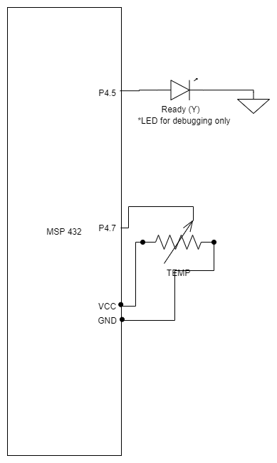

# LAB4 – Low Power

Rock Boynton

EE 4930/011

01/28/2020

## Objectives

The objective of this lab is to write code for a low power application and to use tools to measure
and analyze code performance in terms of power and energy.

## Description

This lab implements a remote temperature measurement system for an eagle's nest as part of a study
to monitor their habits. Eagles must maintain a temperature of about 105 deg. F in the eggs. Eggs normally take 35 days to incubate. Nests typically contain 1 – 3 eggs. Eggs are laid three days apart. The system will need to run a minimum of 70 days to allow time to get it installed well ahead of eggs being laid, time for all eggs to hatch, and uncertainty as to exactly when the eggs will be laid.

Specifications:

* The code must use the A/D to measure temperature in degrees F (resolution of 0.1 deg. F min.) using a TMP36 sensor. The temperature reading must be stored in a global variable that the wireless radio can access, and the radio must be notified that a new value is available for transmission (e.g., set an output high for some short time interval, then back low).
* Temperature readings must be taken about every ten minutes and transmitted to the base station.
* The battery is a CR2032 lithium battery with a capacity of about 210 mAhr.
* Use the Energy Trace tool to analyze your code in terms of its time spent in various modes.
* Use a series resistor (e.g., 10 Ohms) in the power connection to measure the actual power supply current of the system on an oscilloscope.
* Calculate the estimated battery life of your system using both the Energy Trace data and the scope data.
* For code demo, set the time between readings to something more reasonable, like 10 seconds.


## Conclusion

This was a very challenging lab. Getting the main functionality of the system wasn't too difficult,
though, I just had a small snag when setting up the Watchdog timer interrupt in the NVIC. I began
my work on this by testing I originally implemented it using two timers, TimerA0 and TimerA1. TimerA0 was used to
periodically kick off the A/D conversion and TimerA1 was used to set the result ready indicator pin
high for a brief period. I was able to translate that solution into a low power one eventually by
using the watchdog timer in two different intervals depending on whether the result was ready or if
it was waiting on a new result. I chose just using the WDT because it is available in LPM3 and
seemed relatively simple to get working over the RTC. It would be interesting to try LPM3.5 but
perhaps another time as there was a few more steps involved.

Where I had the biggest problems, though was the fact that I was not getting more than ~10 days of
battery life even when verifying that I was going into LPM3. It turns out, just having other small
components e.g. LCD wiring, potentiometers, and LEDs caused a **significant** current draw and when
I removed those, my battery life shot up to **~8 months**, plenty more than the 70 days required. It felt very good to finally get it working.
I wasn't able to see scope data, but from what I have read up on TI forums, Energy Trace is more
accurate.

## Source Code

```c
/*****************************************************************************
MSP432 main.c

Rock Boynton
01/28/2020
EE4930 Lab 5 - Low Power

Description:
    Low Power eagle's nest temperature monitor

*********   Analog Devices TMP36 temperature sensor   ***********************
Signal    (TMP36)      LaunchPad pin
+Vs       (pin 1)      power
Vout      (pin 2)      connected to P4.7
GND       (pin 3)      ground

*********   Nokia LCD interface reference   **********************************

Red SparkFun Nokia 5110 (LCD-10168)
-----------------------------------
Signal        (Nokia 5110) LaunchPad pin
3.3V          (VCC, pin 1) power
Ground        (GND, pin 2) ground
UCA3STE       (SCE, pin 3) connected to P9.4
Reset         (RST, pin 4) connected to P9.3
Data/Command  (D/C, pin 5) connected to P9.2
UCA3SIMO      (DN,  pin 6) connected to P9.7
UCA3CLK       (SCLK, pin 7) connected to P9.5
back light    (LED, pin 8) not connected
*****************************************************************************/
#include <stdio.h>
#include <stdlib.h>
#include <stdint.h>
#include <stdbool.h>

#include "msp.h"

//#include "msoe_lib_lcd.h"
#include "msoe_lib_misc.h"

// Defines
#define TWELVE_BIT_ADC_RANGE 4096

volatile float temp = 0;
volatile bool result_ready = false;

/**
 * @brief Initialize input pins
 *
 * Output pin P4.5 for indicating temp reading is available
 *
 */
void init_outputs(void)
{
    // pin P4.5
    P4->DIR |= BIT5;  // configure as output
    P4->OUT &= ~BIT5; // set output low to start
}

/**
 * @brief Initialize GPIOs
 *
 * Set unused pins to pullup/down enabled to avoid floating inputs
 *
 */
void init_gpio(void)
{
    // set unused pins to pullup/down enabled to avoid floating inputs
    P1->REN |= 0xFF;
    P2->REN |= 0xFF;
    P3->REN |= 0xFF;
    P4->REN |= 0xFF;
    P5->REN |= 0xFF;
    P6->REN |= 0xFF;
    P7->REN |= 0xFF;
    P8->REN |= 0xFF;
    P9->REN |= 0xFF;
    P10->REN |= 0xFF;

    init_outputs();
}

void init_wdt()
{
    //Configure WDT_A
    WDT_A->CTL = WDT_A_CTL_PW // use password
            | WDT_A_CTL_SSEL__BCLK // use BCLK
            | WDT_A_CTL_TMSEL // interval timer mode
            | WDT_A_CTL_CNTCL // clear the count
            | WDT_A_CTL_IS_6; // ~2 ms initial interval
    NVIC->ISER[0] |= 1 << WDT_A_IRQn;
}

void init_cs()
{
    CS->KEY = CS_KEY_VAL;     //unlock
    CS->CLKEN |= CS_CLKEN_REFO_EN; // turn refo clk on
    CS->CTL1 |= CS_CTL1_SELB; // source REFOCLK for BCLK
    CS->CTL1 &= CS_CTL1_SELS_MASK; // clear SELM
    CS->CTL1 |= CS_CTL1_SELS__REFOCLK; // source REFOCLK for SMCLK
    CS->KEY = 0;              // lock
}

void init_pcm()
{
    PCM->CTL0 = PCM_CTL0_KEY_VAL // unlock PCM/PMR
                | PCM_CTL0_LPMR__LPM3 // request LMP3
                | PCM_CTL0_AMR__AM_LF_VCORE0; // LP_AM_LDO_VCORE0
    SCB->SCR &= ~SCB_SCR_SLEEPONEXIT_Msk; // disable wake from interrupt
}

/**
 * @brief Initialize analog-to-digital converters (ADC)
 *
 * Initializes the temperature (P4.7)
 */
void init_adc(void)
{
    // Sampling time, S&H=96, ADC14 on, SMCLK, single input, single conv.
    ADC14->CTL0 |= ADC14_CTL0_SHT0_5 | ADC14_CTL0_SHP | ADC14_CTL0_SSEL__SMCLK | ADC14_CTL0_ON;
    ADC14->CTL1 &= ~(ADC14_CTL1_RES_2 | ADC14_CTL1_RES_1);     // clear res bits
    ADC14->CTL1 |= ADC14_CTL1_RES__12BIT | ADC14_CTL1_PWRMD_2; // set 12 bit resolution, low power
    ADC14->CTL1 |= (4 << ADC14_CTL1_CSTARTADD_OFS);            // use MEM[4]
    ADC14->MCTL[4] |= ADC14_MCTLN_INCH_6;                      // input on A6
    ADC14->IER0 |= ADC14_IER0_IE4;                             // enable interrupt
    ADC14->CTL0 |= ADC14_CTL0_ENC;
    NVIC->ISER[0] |= ADC14_IER0_IE24; // enable ADC interrupt in NVIC

    P4->SEL1 |= BIT7; // give A/D control of pin - A6
    P4->SEL0 |= BIT7;
}

/**
 * @brief ADC interrupt handler
 *
 * Reads the value and updates the temperature
 *
 */
void ADC14_IRQHandler(void)
{
    uint32_t adc_reading = ADC14->MEM[4];
    uint32_t adc_voltage = adc_reading * (3300.0f / TWELVE_BIT_ADC_RANGE);
    float temp_c = (adc_voltage - 500) / 10.0f; // 10mV/C and 500mV offset
    temp = temp_c * 9.0f / 5.0f + 32;
    result_ready = true;
    P4->OUT |= BIT5;          // indicate temp reading is available
}

// Interrupt Handler for the watchdog timer
void WDT_A_IRQHandler(void)
{
    // wakes up from LPM3 into LPM0
}

void main(void)

{
    WDT_A->CTL = WDT_A_CTL_PW | WDT_A_CTL_HOLD;   // Stop watchdog timer

    // setup
    init_pcm();
    init_gpio();
    Set_ports_to_out();
    init_cs();
    init_adc();
    init_wdt();

    __enable_interrupts(); // global interrupt enable

    while (1)
    {
        if (result_ready)
        {
            P4->OUT &= ~BIT5;            // end indication
            result_ready = false;
            WDT_A->CTL = WDT_A_CTL_PW // use password
                        | WDT_A_CTL_SSEL__BCLK // use BCLK
                        | WDT_A_CTL_TMSEL // interval timer mode
                        | WDT_A_CTL_CNTCL // clear the count
                        | WDT_A_CTL_IS_2; // ~5 min interval
            __deep_sleep(); // wait in LPM3 for watchdog - next temp reading
        }
        else
        {
            ADC14->CTL0 |= ADC14_CTL0_SC; // start a new ADC conversion
            __sleep(); // wait for adc
            WDT_A->CTL = WDT_A_CTL_PW // use password
                        | WDT_A_CTL_SSEL__BCLK // use BCLK
                        | WDT_A_CTL_TMSEL // interval timer mode
                        | WDT_A_CTL_CNTCL // clear the count
                        | WDT_A_CTL_IS_6; // ~2 ms interval
            __deep_sleep(); // wait in LPM3 for watchdog - result ready indicator
        }
    }
}
```

## Schematic & Energy Trace Output




