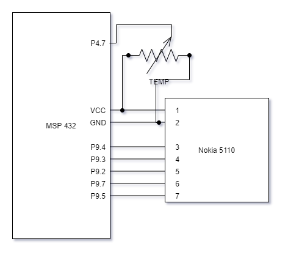

# LAB6 – RTOS Phase 1

Rock Boynton

EE 4930/011

02/12/2021

## Objectives

The objective of this lab is to configure a basic RTOS system implementing tasks, events, hardware
interrupts, and software interrupts, as well as applying past experience of setting up and A/D to
run on a periodic basis using a system timer and software interrupt, plus being able to output that
information on an LCD display.

## Description

This laboratory interfaces a voltage signal from a potentiometer to the microcontroller board using
an analog input and an A/D converter. Software is written that displays the conversion information on the LCD
display. These actions are implemented using a Real Time Operating System (RTOS).

Specifications:
* The A/D input will be the voltage from a simple voltage divider circuit that uses a potentiometer (pot) connected to 3.3 V and ground, with the pot wiper connected to one of the A/D inputs.

* This A/D input will represent a setpoint temperature for a temperature control device. The input needs to be scaled to represent user selectable values in the range of 50 – 90 deg. F. Put the scaled reading on the display as follows:

    “Setpt: xx F”

Where xx is replaced by the converted temperature value. Your temperature output will be a rounded version of the actual temperature (Integer value).
* Update the setpoint value on the display only when the value changes.

* Setup two tasks, one for managing the LCD display, and one for managing inputs.
  - **I chose the I chose the priority level for the task to manage the inputs higher than the task
    to manage the LCD display because it is more important for the temperature setpoint to be
    properly read than for the display to update right away**

* Setup the A/D for generating an interrupt when a conversion is complete. Setup the corresponding Hwi to handle this interrupt and have it call an Swi to actually do the work of reading the conversion value and performing the scaling to a temperature value. Note: the RTOS remaps the interrupt numbers – the A/D in the RTOS is interrupt number 40, not number 24.

* Setup a clock object to run at an appropriate period for reading the setpoint pot.
  * **I chose to
  make this around 10ms (100Hz) as any faster would be imperceptible to humans, but slower may seem
  a little laggy (considering modern media plays at 60Hz with some even higher)**

* Use an event to let the input task know when a new pot reading is available. The task should block on this event. Once the event occurs, the task should check to see if the value changed. If it did change, post a different event to indicate to the display task that a new setpoint value is ready for display, and then wait for the next A/D reading event.

* Use an event to let the display task know that a different value is available and needs to be put on the display. After this is done, the display task should wait for the next event. Note: with the RTOS, you may need to delay after you call the LCD init function for it to work.


## Conclusion

This was a very good way to get familiar with the concepts of a Real Time Operating System. I
learned more in depth about how events, HWIs, SWIs, tasks, pending and posting, etc. all work. Only
needing to use an A/D with a pot was nice as we had experience with those already and didn't need to
worry about learning that on top of this.

I found it very helpful beginning with the Event example from TI's resource explorer and found I
really didn't change a whole lot of the general structure in my solution besides removing the
semaphore and mailbox stuff and of course adding the ADC code from earlier labs. From there it was
just a matter of reading the user guide for more information on setting up the structures and using
the params objects and the like.

I also eventually want to experiment with using FreeRTOS as I have seen that specifically on many job
applications that interest me, and being open-source, I may even like to contribute to it.

## Source Code

```c
/*
 * Copyright (c) 2015-2019, Texas Instruments Incorporated
 * All rights reserved.
 *
 * Redistribution and use in source and binary forms, with or without
 * modification, are permitted provided that the following conditions
 * are met:
 *
 * *  Redistributions of source code must retain the above copyright
 *    notice, this list of conditions and the following disclaimer.
 *
 * *  Redistributions in binary form must reproduce the above copyright
 *    notice, this list of conditions and the following disclaimer in the
 *    documentation and/or other materials provided with the distribution.
 *
 * *  Neither the name of Texas Instruments Incorporated nor the names of
 *    its contributors may be used to endorse or promote products derived
 *    from this software without specific prior written permission.
 *
 * THIS SOFTWARE IS PROVIDED BY THE COPYRIGHT HOLDERS AND CONTRIBUTORS "AS IS"
 * AND ANY EXPRESS OR IMPLIED WARRANTIES, INCLUDING, BUT NOT LIMITED TO,
 * THE IMPLIED WARRANTIES OF MERCHANTABILITY AND FITNESS FOR A PARTICULAR
 * PURPOSE ARE DISCLAIMED. IN NO EVENT SHALL THE COPYRIGHT OWNER OR
 * CONTRIBUTORS BE LIABLE FOR ANY DIRECT, INDIRECT, INCIDENTAL, SPECIAL,
 * EXEMPLARY, OR CONSEQUENTIAL DAMAGES (INCLUDING, BUT NOT LIMITED TO,
 * PROCUREMENT OF SUBSTITUTE GOODS OR SERVICES; LOSS OF USE, DATA, OR PROFITS;
 * OR BUSINESS INTERRUPTION) HOWEVER CAUSED AND ON ANY THEORY OF LIABILITY,
 * WHETHER IN CONTRACT, STRICT LIABILITY, OR TORT (INCLUDING NEGLIGENCE OR
 * OTHERWISE) ARISING IN ANY WAY OUT OF THE USE OF THIS SOFTWARE,
 * EVEN IF ADVISED OF THE POSSIBILITY OF SUCH DAMAGE.
 */

/*
 *  ======== event.c ========
MSP432 main.c

Rock Boynton
02/11/2021
EE4930 Lab 1

Description:
    Reads from a potentiometer with an ADC. ADC reading is
    periodically taken using a TI RTOS clock.

*********   Bourns 3352T-1-103LF-10K potentiometer reference   ***************
Signal (Bourns 3352T)  LaunchPad pin
GND    (CCW,   pin 1)  ground
Wiper  (Wiper, pin 2)  connected to P4.7
VCC    (CW,    pin 3)  power

*********   Nokia LCD interface reference   **********************************

Red SparkFun Nokia 5110 (LCD-10168)
-----------------------------------
Signal        (Nokia 5110) LaunchPad pin
3.3V          (VCC, pin 1) power
Ground        (GND, pin 2) ground
UCA3STE       (SCE, pin 3) connected to P9.4
Reset         (RST, pin 4) connected to P9.3
Data/Command  (D/C, pin 5) connected to P9.2
UCA3SIMO      (DN,  pin 6) connected to P9.7
UCA3CLK       (SCLK, pin 7) connected to P9.5
back light    (LED, pin 8) not connected
 */

#define __MSP432P401R__
#include "msp.h"

#include <stdio.h>
#include <string.h>

#include "msoe_lib_clk.h"
#include "msoe_lib_lcd.h"
#include "msoe_lib_delay.h"

/* XDC module Headers */
#include <xdc/std.h>
#include <xdc/runtime/Error.h>
#include <xdc/runtime/System.h>
#include <xdc/runtime/Timestamp.h>

/* BIOS module Headers */
#include <ti/sysbios/BIOS.h>
#include <ti/sysbios/knl/Clock.h>
#include <ti/sysbios/knl/Swi.h>
#include <ti/sysbios/hal/Hwi.h>
#include <ti/sysbios/knl/Task.h>
#include <ti/sysbios/knl/Event.h>

#include <ti/drivers/Board.h>

#define CLOCK_PERIOD 10 // number of clock ticks per adc trigger \
                      // period of ~10 ms

#define TASK_STACK_SIZE 512
#define ADC_INTERRUPT 40 // interrupt number for the ADC
#define ADC_RANGE 256  // for 8 bit conversions

Task_Struct check_for_input_task_struct, update_lcd_task_struct;
Char check_for_input_task_stack[TASK_STACK_SIZE], update_lcd_task_stack[TASK_STACK_SIZE];

Clock_Struct clock_struct;
Clock_Handle clock_handle;

Event_Struct reading_available_event_struct, lcd_event_struct;
Event_Handle reading_available_event_handle, lcd_event_handle;

Swi_Struct adc_swi_struct;
Swi_Handle adc_swi_handle;

Hwi_Struct adc_hwi_struct;
Hwi_Handle adc_hwi_handle;

uint8_t temperature = 0;

/**
 * @brief Initialize the LCD
 *
 * Sets it up to display temperature set point
 *
 */
void init_lcd(void)
{
    LCD_Config();
    LCD_clear();
    LCD_home();
    LCD_contrast(10);

    LCD_print_str("Temp: xx F");
}

void init_adc()
{
    // Sampling time, S&H=96, ADC14 on, SMCLK, single input, single conv.
    ADC14->CTL0 |= ADC14_CTL0_SHT0_5 | ADC14_CTL0_SHP | ADC14_CTL0_SSEL_4 | ADC14_CTL0_ON;
    ADC14->CTL1 &= ~(ADC14_CTL1_RES_2 | ADC14_CTL1_RES_1); // 8-bit conversion
    ADC14->CTL1 |= (4 << ADC14_CTL1_CSTARTADD_OFS);        // use MEM[4]
    ADC14->MCTL[4] |= ADC14_MCTLN_INCH_6;                  // input on A6
    ADC14->IER0 |= ADC14_IER0_IE4;                         // enable interrupt
    ADC14->CTL0 |= ADC14_CTL0_ENC;

    P4->SEL1 |= BIT7; // give A/D control of pin - A6
    P4->SEL0 |= BIT7;
}

/*
 * Clock function triggers an ADC conversion
 */
Void start_conversion()
{
    ADC14->CTL0 |= 1; // start ADC conversions
}

/*
 * Pends on an LCD update event to update the LCD with a new temperature reading
 */
Void update_lcd()
{
    UInt posted;

    while (1)
    {
        //wait for event
        posted = Event_pend(lcd_event_handle,
                            Event_Id_00,
                            Event_Id_NONE,
                            BIOS_WAIT_FOREVER);
        if (posted == 0)
        {
            System_printf("Timeout expired for Event_pend()\n");
            break;
        }
        // update the LCD if the correct event trigger was posted.
        if (posted & Event_Id_00)
        {
            LCD_goto_xy(5, 0);
            LCD_print_udec3(temperature);
        }
    }
}

/*
 * Pends on a new reading to be available from the ADC. Conditionally updates the LCD if the value
 * has changed.
 */
Void check_for_input()
{
    UInt posted;
    uint8_t old_temp = 0;

    while (1)
    {
        // waits for a reading to be available
        posted = Event_pend(reading_available_event_handle,
                            Event_Id_00,
                            Event_Id_NONE,
                            BIOS_WAIT_FOREVER);

        if (posted == 0)
        {
            System_printf("Timeout expired for Event_pend()\n");
            break;
        }

        // signal to LCD task if the new temperature value is different than whats currently displayed
        if (posted & Event_Id_00)
        {
            if (temperature != old_temp)
            {
                old_temp = temperature;
                Event_post(lcd_event_handle, Event_Id_00);
            }
        }
    }
    BIOS_exit(0);
}

/*
 * Hardware Interrupt handler
 * Called when a new ADC value is ready.
 * Posts to a software interrupt to read ADC and convert to temperature
 */
Void adc_hwi()
{
    uint32_t adc_val = ADC14->MEM[4]; //clear the interrupt by reading the value
    Swi_post(adc_swi_handle); // signal to the SWI that a new conversion is ready
}

/*
 * Software interrupt handler
 * Reads the ADC value and converts it to the temperature range 50 - 90 F
 * Posts event check_for_input that a new value is available
 */
Void adc_swi()
{
    temperature = (((float)ADC14->MEM[4]) / ADC_RANGE) * (90 - 50 + 1) + 50;
    Event_post(reading_available_event_handle, Event_Id_00);
}

int main()
{

    WDT_A->CTL = WDT_A_CTL_PW | WDT_A_CTL_HOLD; // stop watchdog timer

    init_lcd();
    Hwi_enable();
    init_adc();

    /* Construct BIOS Objects */
    Task_Params task_params;
    Clock_Params clock_params;
    Swi_Params adc_swi_params;
    Hwi_Params adc_hwi_params;

    /* Call driver init functions */
    Board_init();

    /* Construct Task threads */
    Task_Params_init(&task_params);
    task_params.stackSize = TASK_STACK_SIZE;
    // updating the internal temperature is less important than handling the HW interrupts
    // but more important than updating the LCD display
    task_params.priority = 3;
    task_params.stack = &check_for_input_task_stack;
    Task_construct(&check_for_input_task_struct, (Task_FuncPtr)check_for_input, &task_params, NULL);

    // lcd update is least important
    task_params.priority = 4;
    task_params.stack = &update_lcd_task_stack;
    Task_construct(&update_lcd_task_struct, (Task_FuncPtr)update_lcd, &task_params, NULL);

    /* Obtain event handlers */
    Event_construct(&reading_available_event_struct, NULL);
    reading_available_event_handle = Event_handle(&reading_available_event_struct);

    Event_construct(&lcd_event_struct, NULL);
    lcd_event_handle = Event_handle(&lcd_event_struct);

    /* setup clock */
    Clock_Params_init(&clock_params);
    clock_params.startFlag = TRUE;
    Clock_construct(&clock_struct, (Clock_FuncPtr)start_conversion, CLOCK_PERIOD * 2, &clock_params);
    clock_handle = Clock_handle(&clock_struct);
    Clock_setPeriod(clock_handle, CLOCK_PERIOD);

    /* setup SWI */
    Swi_Params_init(&adc_swi_params);
    adc_swi_params.priority = 2; // priority after HWI
    adc_swi_params.trigger = 0;

    Swi_construct(&adc_swi_struct, (Swi_FuncPtr)adc_swi, &adc_swi_params, NULL);
    adc_swi_handle = Swi_handle(&adc_swi_struct);

    /* setup HWI */
    Hwi_Params_init(&adc_hwi_params);
    adc_hwi_params.eventId = ADC_INTERRUPT;
    adc_hwi_params.priority = 1; // top priority
    Hwi_construct(&adc_hwi_struct, ADC_INTERRUPT, (Hwi_FuncPtr)adc_hwi, &adc_hwi_params, NULL);
    adc_hwi_handle = Hwi_handle(&adc_hwi_struct);

    /* start the BIOS */
    BIOS_start();
    return (0);
}

```

## Schematic


