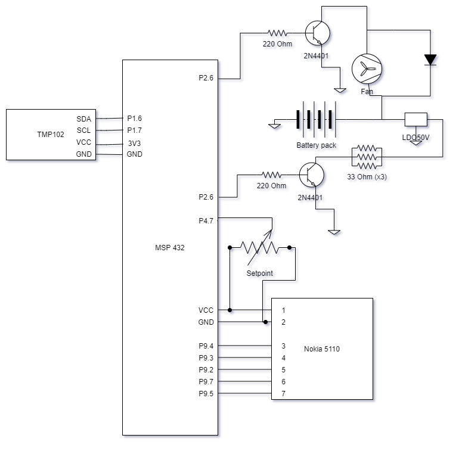

# LAB7 – Igloo Controller

Rock Boynton

EE 4930/011

02/23/2021

## Objectives

The objective of this lab is to configure a moderately complex RTOS system implementing tasks, events, hardware
interrupts, and software interrupts, as well as applying past experience of setting up and A/D to
run on a periodic basis using a system timer and software interrupt, plus being able to output that
information on an LCD display. This system also adds an additional layer of complexity by requiring
the use of I2C drivers to communicate with a temperature sensor.

## Description

This lab implements an igloo environment controller to control the inside temperature of an igloo located in the Prudhoe Bay, Alaska area. Cooling will not be an issue, so the controller only needs to have heating capabilities. The I/O specs are:

* Inputs: Temperature inside the igloo
	Setpoint temperature

* Outputs: Fan control (ON/OFF)
	Heating coil control (ON/OFF)

* Display of current state of the system (setpoint, temperature, output conditions)

A ±1 deg. F hysteresis setting in the control of the temperature. Your kit contains several temperature sensors for you to choose from for measuring temperature. The setpoint information can come from a pot, or you can use switches to increase/decrease the value. The fan and heat output control will need to utilize the 2N4401 transistors, since the MSP432 pins can’t source enough current. The circuit to use for this will be discussed in lab. This circuit will also require the 5V regulator and battery pack. Use the heatsink with the regulator (get heatsink thermal compound from tech support). Use the three 33 Ohm resistors in parallel as the heating coil. These will also need a transistor interface to operate. Note: you may find it necessary to control the fan via PWM to be able to reduce the effective airflow. (I found a duty cycle of 20% at a frequency of 12.5 Hz to work well).

The ‘igloo’ is assembled using cardstock paper using the pattern supplied. The binder clips can be
used to hold it together. The four long screws are attached to the fan to provide support and stability.

## Conclusion

This was a pretty challenging but fun lab to complete. It was good to build upon what we had learned
in RTOS in the previous lab and in the course. It was good getting experience using a driver, the
I2C driver, with the temperature sensor because I feel like that is most like what most of us will be doing
in the future in our career, rather than writing them ourselves (where available of course).

This lab was more intimidating than I gave it credit for. I had the most issues getting the
circuit/wiring right than I ended up having with the code itself, although i did have some issues
there as well. Particularly, with the drivers, I found I had to configure the pins used for SDA and
SCL in the `*.syscfg` file which I do not believe was covered in lecture and I may have missed it in
the user manual.

One other issue I had was the fan being too powerful, and I ended up using a PWM driver to slow it
down. The example code in resource explorer was very helpful for both the PWM driver and the I2C driver.

## Source Code

```c
/*
 * Copyright (c) 2015-2019, Texas Instruments Incorporated
 * All rights reserved.
 *
 * Redistribution and use in source and binary forms, with or without
 * modification, are permitted provided that the following conditions
 * are met:
 *
 * *  Redistributions of source code must retain the above copyright
 *    notice, this list of conditions and the following disclaimer.
 *
 * *  Redistributions in binary form must reproduce the above copyright
 *    notice, this list of conditions and the following disclaimer in the
 *    documentation and/or other materials provided with the distribution.
 *
 * *  Neither the name of Texas Instruments Incorporated nor the names of
 *    its contributors may be used to endorse or promote products derived
 *    from this software without specific prior written permission.
 *
 * THIS SOFTWARE IS PROVIDED BY THE COPYRIGHT HOLDERS AND CONTRIBUTORS "AS IS"
 * AND ANY EXPRESS OR IMPLIED WARRANTIES, INCLUDING, BUT NOT LIMITED TO,
 * THE IMPLIED WARRANTIES OF MERCHANTABILITY AND FITNESS FOR A PARTICULAR
 * PURPOSE ARE DISCLAIMED. IN NO EVENT SHALL THE COPYRIGHT OWNER OR
 * CONTRIBUTORS BE LIABLE FOR ANY DIRECT, INDIRECT, INCIDENTAL, SPECIAL,
 * EXEMPLARY, OR CONSEQUENTIAL DAMAGES (INCLUDING, BUT NOT LIMITED TO,
 * PROCUREMENT OF SUBSTITUTE GOODS OR SERVICES; LOSS OF USE, DATA, OR PROFITS;
 * OR BUSINESS INTERRUPTION) HOWEVER CAUSED AND ON ANY THEORY OF LIABILITY,
 * WHETHER IN CONTRACT, STRICT LIABILITY, OR TORT (INCLUDING NEGLIGENCE OR
 * OTHERWISE) ARISING IN ANY WAY OUT OF THE USE OF THIS SOFTWARE,
 * EVEN IF ADVISED OF THE POSSIBILITY OF SUCH DAMAGE.
 */

/*
 *  ======== event.c ========
MSP432 event.c

Rock Boynton
02/23/2021
EE4930 Final

Description:
    Controller for an igloo. Provides heating and fan control.

*********   Bourns 3352T-1-103LF-10K potentiometer reference   ***************
Signal (Bourns 3352T)  LaunchPad pin
GND    (CCW,   pin 1)  ground
Wiper  (Wiper, pin 2)  connected to P4.7
VCC    (CW,    pin 3)  power

*********   Nokia LCD interface reference   **********************************

Red SparkFun Nokia 5110 (LCD-10168)
-----------------------------------
Signal        (Nokia 5110) LaunchPad pin
3.3V          (VCC, pin 1) power
Ground        (GND, pin 2) ground
UCA3STE       (SCE, pin 3) connected to P9.4
Reset         (RST, pin 4) connected to P9.3
Data/Command  (D/C, pin 5) connected to P9.2
UCA3SIMO      (DN,  pin 6) connected to P9.7
UCA3CLK       (SCLK, pin 7) connected to P9.5
back light    (LED, pin 8) not connected
 */

#define __MSP432P401R__
#include "msp.h"

#include <stdio.h>
#include <string.h>

#include "msoe_lib_clk.h"
#include "msoe_lib_lcd.h"
#include "msoe_lib_delay.h"

/* XDC module Headers */
#include <xdc/std.h>
#include <xdc/runtime/Error.h>
#include <xdc/runtime/System.h>
#include <xdc/runtime/Timestamp.h>

/* BIOS module Headers */
#include <ti/sysbios/BIOS.h>
#include <ti/sysbios/knl/Clock.h>
#include <ti/sysbios/knl/Swi.h>
#include <ti/sysbios/hal/Hwi.h>
#include <ti/sysbios/knl/Task.h>
#include <ti/sysbios/knl/Event.h>

#include <ti/drivers/Board.h>

/* TI Drivers */
#include <ti/drivers/I2C.h>
#include <ti/drivers/PWM.h>

#define CLOCK_PERIOD 10 // number of clock ticks per adc trigger \
                      // period of ~10 ms

#define TASK_STACK_SIZE 1024
#define ADC_INTERRUPT 40 // interrupt number for the ADC
#define ADC_RANGE 256  // for 8 bit conversions

Task_Struct check_for_input_task_struct, update_lcd_task_struct, get_temp_i2c_task_struct, heater_task_struct;
Char check_for_input_task_stack[TASK_STACK_SIZE], update_lcd_task_stack[TASK_STACK_SIZE], get_temp_i2c_task_stack[TASK_STACK_SIZE], heater_task_stack[TASK_STACK_SIZE];

Clock_Struct clock_struct;
Clock_Handle clock_handle;

Event_Struct reading_available_event_struct, lcd_event_struct;
Event_Handle reading_available_event_handle, lcd_event_handle;

Swi_Struct adc_swi_struct;
Swi_Handle adc_swi_handle;

Hwi_Struct adc_hwi_struct;
Hwi_Handle adc_hwi_handle;

uint8_t setpoint = 0;
uint16_t temperature = 0;
Bool heating = false;

/**
 * @brief Initialize the LCD
 *
 * Sets it up to display setpoint set point
 *
 */
void init_lcd(void)
{
    LCD_Config();
    LCD_clear();
    LCD_home();
    LCD_contrast(10);

    LCD_print_str("Setpt: xx F");
    LCD_goto_xy(0, 1);
    LCD_print_str("Temp:  xx F");
    LCD_goto_xy(0, 2);
    LCD_print_str("Heat:  OFF");
}

void init_adc()
{
    // Sampling time, S&H=96, ADC14 on, SMCLK, single input, single conv.
    ADC14->CTL0 |= ADC14_CTL0_SHT0_5 | ADC14_CTL0_SHP | ADC14_CTL0_SSEL_4 | ADC14_CTL0_ON;
    ADC14->CTL1 &= ~(ADC14_CTL1_RES_2 | ADC14_CTL1_RES_1); // 8-bit conversion
    ADC14->CTL1 |= (4 << ADC14_CTL1_CSTARTADD_OFS);        // use MEM[4]
    ADC14->MCTL[4] |= ADC14_MCTLN_INCH_6;                  // input on A6
    ADC14->IER0 |= ADC14_IER0_IE4;                         // enable interrupt
    ADC14->CTL0 |= ADC14_CTL0_ENC;

    P4->SEL1 |= BIT7; // give A/D control of pin - A6
    P4->SEL0 |= BIT7;
}

/*
 * Clock function triggers an ADC conversion
 */
Void start_conversion()
{
    ADC14->CTL0 |= 1; // start ADC conversions
}

Void get_temp_i2c()
{
    uint16_t tmp_data;
    uint8_t rxBuffer[2];

    I2C_Params params;
    I2C_Params_init(&params);
    params.bitRate = I2C_400kHz;

    I2C_Handle i2cHandle = I2C_open(0, &params);
    I2C_Transaction transaction;
    transaction.slaveAddress = 0x48;
    transaction.readBuf = rxBuffer;
    transaction.readCount = sizeof(rxBuffer);
    transaction.writeCount = 0;

    /* Take samples forever */
    while (1)
    {
        //get a new sample the same time the adc conversions finnish. ~0.5 sec
        UInt posted = Event_pend(reading_available_event_handle,
                                Event_Id_00,
                                Event_Id_NONE,
                                BIOS_WAIT_FOREVER);

        if (posted == 0)
        {
            System_printf("Timeout expired for Event_pend()\n");
            break;
        }

        // signal to LCD task if the new temperature value is different than whats currently displayed
        if (posted & Event_Id_00)
        {
            if (I2C_transfer(i2cHandle, &transaction))
            {
                tmp_data = (rxBuffer[0] << 4) | (rxBuffer[1] >> 4); // combine data result before multiplication
                temperature = (tmp_data * 0.0625);                      // convert to reading to celsius
                temperature = ((((float)temperature) * 9) / 5) + 32;    // convert celsius to farenheight
            }
            else
            {
                System_printf("I2C bus fault.\n");
            }
        }
    }

    I2C_close(i2cHandle);
    BIOS_exit(0);
}

Void heater()
{
    UInt posted;

    //setup pwm
    PWM_Handle pwm;
    PWM_Params pwmParams;
    uint32_t dutyValue;
    // Initialize the PWM parameters
    PWM_Params_init(&pwmParams);
    pwmParams.idleLevel = PWM_IDLE_LOW;
    pwmParams.periodUnits = PWM_PERIOD_HZ;
    pwmParams.periodValue = 13;              // 1MHz
    pwmParams.dutyUnits = PWM_DUTY_FRACTION; // fractional percentage
    pwmParams.dutyValue = 0;                 // 0% initial duty cycle
    // get PWM instance
    pwm = PWM_open(0, &pwmParams);
    if (pwm == NULL)
    {
        // PWM_open() failed
        while (1){}
    }
    dutyValue = (uint32_t)(((uint64_t)PWM_DUTY_FRACTION_MAX * 50) / 100);
    PWM_setDuty(pwm, dutyValue); // set duty cycle to 40%

    while (1)
    {
        //update output the same time the adc conversion finishes.
        posted = Event_pend(reading_available_event_handle,
                            Event_Id_00,
                            Event_Id_NONE,
                            BIOS_WAIT_FOREVER);

        if (posted == 0)
        {
            System_printf("Timeout expired for Event_pend()\n");
            break;
        }
        if (posted & Event_Id_00)
        {
            if ((temperature - 1) >= setpoint)
            {
                //turn heater off
                P2->OUT &= ~(BIT4 | BIT6);
                PWM_stop(pwm);
                heating = false;
            }
            else if ((temperature + 1) <= setpoint)
            {
                //turn heater on
                P2->OUT |= BIT6;
                PWM_start(pwm);
                heating = true;
            }
        }
    }

    BIOS_exit(0); //should never get here
}

init_gpio()
{
    // pin P2.4 -- fan
    P2->DIR |= BIT4;  // configure as output
    P2->OUT &= ~BIT4; // set output low to start

    // pin P2.6 -- heater
    P2->DIR |= BIT6;  // configure as output
    P2->OUT &= ~BIT6; // set output low to start
}

/*
 * Pends on an LCD update event to update the LCD with a new setpoint temperature
 */
Void update_lcd()
{
    UInt posted;

    while (1)
    {
        //wait for event
        posted = Event_pend(lcd_event_handle,
                            Event_Id_00,
                            Event_Id_NONE,
                            BIOS_WAIT_FOREVER);
        if (posted == 0)
        {
            System_printf("Timeout expired for Event_pend()\n");
            break;
        }
        // update the LCD if the correct event trigger was posted.
        if (posted & Event_Id_00)
        {
            LCD_goto_xy(6, 0);
            LCD_print_udec3(setpoint);
            LCD_goto_xy(6, 1);
            LCD_print_udec3(temperature);
            LCD_goto_xy(7, 2);
            LCD_print_str(heating ? "ON " : "OFF");
        }
    }
}

/*
 * Pends on a new reading to be available from the ADC. Conditionally updates the LCD if the value
 * has changed.
 */
Void check_for_input()
{
    UInt posted;
    uint8_t old_setpt = 0;
    uint16_t old_temperature = 0;

    while (1)
    {
        // waits for a reading to be available
        posted = Event_pend(reading_available_event_handle,
                            Event_Id_00,
                            Event_Id_NONE,
                            BIOS_WAIT_FOREVER);

        if (posted == 0)
        {
            System_printf("Timeout expired for Event_pend()\n");
            break;
        }

        // signal to LCD task if the new setpoint value or temperature is different than whats currently displayed
        if (posted & Event_Id_00)
        {
            if (setpoint != old_setpt)
            {
                old_setpt = setpoint;
                Event_post(lcd_event_handle, Event_Id_00);
            }
            else if (temperature != old_temperature)
            {
                old_temperature = temperature;
                Event_post(lcd_event_handle, Event_Id_00);
            }
        }
    }
    BIOS_exit(0);
}

/*
 * Hardware Interrupt handler
 * Called when a new ADC value is ready.
 * Posts to a software interrupt to read ADC and convert to setpoint
 */
Void adc_hwi()
{
    uint32_t adc_val = ADC14->MEM[4]; //clear the interrupt by reading the value
    Swi_post(adc_swi_handle); // signal to the SWI that a new conversion is ready
}

/*
 * Software interrupt handler
 * Reads the ADC value and converts it to the setpoint range 50 - 90 F
 * Posts event check_for_input that a new value is available
 */
Void adc_swi()
{
    setpoint = (((float)ADC14->MEM[4]) / ADC_RANGE) * (90 - 50 + 1) + 50;
    Event_post(reading_available_event_handle, Event_Id_00);
}

int main()
{

    WDT_A->CTL = WDT_A_CTL_PW | WDT_A_CTL_HOLD; // stop watchdog timer

    init_lcd();
    Hwi_enable();
    init_adc();
    init_gpio();

    /* Construct BIOS Objects */
    Task_Params task_params;
    Clock_Params clock_params;
    Swi_Params adc_swi_params;
    Hwi_Params adc_hwi_params;

    /* Call driver init functions */
    Board_init();
    I2C_init();
    PWM_init();

    /* Construct Task threads */
    Task_Params_init(&task_params);
    task_params.stackSize = TASK_STACK_SIZE;
    // updating the internal setpoint is less important than handling the HW interrupts
    // but more important than updating the LCD display
    task_params.priority = 4;
    task_params.stack = &check_for_input_task_stack;
    Task_construct(&check_for_input_task_struct, (Task_FuncPtr)check_for_input, &task_params, NULL);

    // lcd update is not super important
    task_params.priority = 5;
    task_params.stack = &update_lcd_task_stack;
    Task_construct(&update_lcd_task_struct, (Task_FuncPtr)update_lcd, &task_params, NULL);

    // getting temperature reading is most important
    task_params.priority = 3;
    task_params.stack = &get_temp_i2c_task_stack;
    Task_construct(&get_temp_i2c_task_struct, (Task_FuncPtr)get_temp_i2c, &task_params, NULL);

    // setting heater is least important
    task_params.priority = 6;
    task_params.stack = &heater_task_stack;
    Task_construct(&heater_task_struct, (Task_FuncPtr)heater, &task_params, NULL);

    /* Obtain event handlers */
    Event_construct(&reading_available_event_struct, NULL);
    reading_available_event_handle = Event_handle(&reading_available_event_struct);

    Event_construct(&lcd_event_struct, NULL);
    lcd_event_handle = Event_handle(&lcd_event_struct);

    /* setup clock */
    Clock_Params_init(&clock_params);
    clock_params.startFlag = TRUE;
    Clock_construct(&clock_struct, (Clock_FuncPtr)start_conversion, CLOCK_PERIOD * 2, &clock_params);
    clock_handle = Clock_handle(&clock_struct);
    Clock_setPeriod(clock_handle, CLOCK_PERIOD);

    /* setup SWI */
    Swi_Params_init(&adc_swi_params);
    adc_swi_params.priority = 2; // priority after HWI
    adc_swi_params.trigger = 0;

    Swi_construct(&adc_swi_struct, (Swi_FuncPtr)adc_swi, &adc_swi_params, NULL);
    adc_swi_handle = Swi_handle(&adc_swi_struct);

    /* setup HWI */
    Hwi_Params_init(&adc_hwi_params);
    adc_hwi_params.eventId = ADC_INTERRUPT;
    adc_hwi_params.priority = 1; // top priority
    Hwi_construct(&adc_hwi_struct, ADC_INTERRUPT, (Hwi_FuncPtr)adc_hwi, &adc_hwi_params, NULL);
    adc_hwi_handle = Hwi_handle(&adc_hwi_struct);

    /* start the BIOS */
    BIOS_start();
    return (0);
}
```

```c
// event.cfg
/*
 * Copyright (c) 2016-2017, Texas Instruments Incorporated
 * All rights reserved.
 *
 * Redistribution and use in source and binary forms, with or without
 * modification, are permitted provided that the following conditions
 * are met:
 *
 * *  Redistributions of source code must retain the above copyright
 *    notice, this list of conditions and the following disclaimer.
 *
 * *  Redistributions in binary form must reproduce the above copyright
 *    notice, this list of conditions and the following disclaimer in the
 *    documentation and/or other materials provided with the distribution.
 *
 * *  Neither the name of Texas Instruments Incorporated nor the names of
 *    its contributors may be used to endorse or promote products derived
 *    from this software without specific prior written permission.
 *
 * THIS SOFTWARE IS PROVIDED BY THE COPYRIGHT HOLDERS AND CONTRIBUTORS "AS IS"
 * AND ANY EXPRESS OR IMPLIED WARRANTIES, INCLUDING, BUT NOT LIMITED TO,
 * THE IMPLIED WARRANTIES OF MERCHANTABILITY AND FITNESS FOR A PARTICULAR
 * PURPOSE ARE DISCLAIMED. IN NO EVENT SHALL THE COPYRIGHT OWNER OR
 * CONTRIBUTORS BE LIABLE FOR ANY DIRECT, INDIRECT, INCIDENTAL, SPECIAL,
 * EXEMPLARY, OR CONSEQUENTIAL DAMAGES (INCLUDING, BUT NOT LIMITED TO,
 * PROCUREMENT OF SUBSTITUTE GOODS OR SERVICES; LOSS OF USE, DATA, OR PROFITS;
 * OR BUSINESS INTERRUPTION) HOWEVER CAUSED AND ON ANY THEORY OF LIABILITY,
 * WHETHER IN CONTRACT, STRICT LIABILITY, OR TORT (INCLUDING NEGLIGENCE OR
 * OTHERWISE) ARISING IN ANY WAY OUT OF THE USE OF THIS SOFTWARE,
 * EVEN IF ADVISED OF THE POSSIBILITY OF SUCH DAMAGE.
 */


/* ================ Clock configuration ================ */
var Clock = xdc.useModule('ti.sysbios.knl.Clock');
/*
 * Default value is family dependent. For example, Linux systems often only
 * support a minimum period of 10000 us and multiples of 10000 us.
 * TI platforms have a default of 1000 us.
 */
Clock.tickPeriod = 1000;


/* ================ Defaults (module) configuration ================ */
var Defaults = xdc.useModule('xdc.runtime.Defaults');
/*
 * A flag to allow module names to be loaded on the target. Module name
 * strings are placed in the .const section for debugging purposes.
 *
 * Pick one:
 *  - true (default)
 *      Setting this parameter to true will include name strings in the .const
 *      section so that Errors and Asserts are easier to debug.
 *  - false
 *      Setting this parameter to false will reduce footprint in the .const
 *      section. As a result, Error and Assert messages will contain an
 *      "unknown module" prefix instead of the actual module name.
 */
Defaults.common$.namedModule = true;
//Defaults.common$.namedModule = false;


/* ================ Error configuration ================ */
var Error = xdc.useModule('xdc.runtime.Error');
/*
 * This function is called to handle all raised errors, but unlike
 * Error.raiseHook, this function is responsible for completely handling the
 * error with an appropriately initialized Error_Block.
 *
 * Pick one:
 *  - Error.policyDefault (default)
 *      Calls Error.raiseHook with an initialized Error_Block structure and logs
 *      the error using the module's logger.
 *  - Error.policySpin
 *      Simple alternative that traps on a while(1) loop for minimized target
 *      footprint.
 *      Using Error.policySpin, the Error.raiseHook will NOT called.
 */
Error.policyFxn = Error.policyDefault;
//Error.policyFxn = Error.policySpin;

/*
 * If Error.policyFxn is set to Error.policyDefault, this function is called
 * whenever an error is raised by the Error module.
 *
 * Pick one:
 *  - Error.print (default)
 *      Errors are formatted and output via System_printf() for easier
 *      debugging.
 *  - null
 *      Errors are not formatted or logged. This option reduces code footprint.
 *  - non-null function
 *      Errors invoke custom user function. See the Error module documentation
 *      for more details.
 */
Error.raiseHook = Error.print;
//Error.raiseHook = null;
//Error.raiseHook = "&myErrorFxn";

/*
 * If Error.policyFxn is set to Error.policyDefault, this option applies to the
 * maximum number of times the Error.raiseHook function can be recursively
 * invoked. This option limits the possibility of an infinite recursion that
 * could lead to a stack overflow.
 * The default value is 16.
 */
Error.maxDepth = 2;


/* ================ Hwi configuration ================ */
var halHwi = xdc.useModule('ti.sysbios.hal.Hwi');
var m3Hwi = xdc.useModule('ti.sysbios.family.arm.m3.Hwi');
/*
 * Checks for Hwi (system) stack overruns while in the Idle loop.
 *
 * Pick one:
 *  - true (default)
 *      Checks the top word for system stack overflows during the idle loop and
 *      raises an Error if one is detected.
 *  - false
 *      Disabling the runtime check improves runtime performance and yields a
 *      reduced flash footprint.
 */
halHwi.checkStackFlag = true;
//halHwi.checkStackFlag = false;

/*
 * The following options alter the system's behavior when a hardware exception
 * is detected.
 *
 * Pick one:
 *  - Hwi.enableException = true
 *      This option causes the default m3Hwi.excHandlerFunc function to fully
 *      decode an exception and dump the registers to the system console.
 *      This option raises errors in the Error module and displays the
 *      exception in ROV.
 *  - Hwi.enableException = false
 *      This option reduces code footprint by not decoding or printing the
 *      exception to the system console.
 *      It however still raises errors in the Error module and displays the
 *      exception in ROV.
 *  - Hwi.excHandlerFunc = null
 *      This is the most aggressive option for code footprint savings; but it
 *      can difficult to debug exceptions. It reduces flash footprint by
 *      plugging in a default while(1) trap when exception occur. This option
 *      does not raise an error with the Error module.
 */
m3Hwi.enableException = true;
//m3Hwi.enableException = false;
//m3Hwi.excHandlerFunc = null;

/*
 * Enable hardware exception generation when dividing by zero.
 *
 * Pick one:
 *  - 0 (default)
 *      Disables hardware exceptions when dividing by zero
 *  - 1
 *      Enables hardware exceptions when dividing by zero
 */
m3Hwi.nvicCCR.DIV_0_TRP = 0;
//m3Hwi.nvicCCR.DIV_0_TRP = 1;

/*
 * Enable hardware exception generation for invalid data alignment.
 *
 * Pick one:
 *  - 0 (default)
 *      Disables hardware exceptions for data alignment
 *  - 1
 *      Enables hardware exceptions for data alignment
 */
m3Hwi.nvicCCR.UNALIGN_TRP = 0;
//m3Hwi.nvicCCR.UNALIGN_TRP = 1;


/* ================ Idle configuration ================ */
var Idle = xdc.useModule('ti.sysbios.knl.Idle');
/*
 * The Idle module is used to specify a list of functions to be called when no
 * other tasks are running in the system.
 *
 * Functions added here will be run continuously within the idle task.
 *
 * Function signature:
 *     Void func(Void);
 */
//Idle.addFunc("&myIdleFunc");

Idle.addFunc('&Power_idleFunc');  /* add the Power module's idle function */


/* ================ Kernel (SYS/BIOS) configuration ================ */
var BIOS = xdc.useModule('ti.sysbios.BIOS');
/*
 * Enable asserts in the BIOS library.
 *
 * Pick one:
 *  - true (default)
 *      Enables asserts for debugging purposes.
 *  - false
 *      Disables asserts for a reduced code footprint and better performance.
 */
//BIOS.assertsEnabled = true;
BIOS.assertsEnabled = false;

/*
 * A flag to determine if xdc.runtime sources are to be included in a custom
 * built BIOS library.
 *
 * Pick one:
 *  - false (default)
 *      The pre-built xdc.runtime library is provided by the respective target
 *      used to build the application.
 *  - true
 *      xdc.runtime library sources are to be included in the custom BIOS
 *      library. This option yields the most efficient library in both code
 *      footprint and runtime performance.
 */
BIOS.includeXdcRuntime = false;
//BIOS.includeXdcRuntime = true;

/*
 * The SYS/BIOS runtime is provided in the form of a library that is linked
 * with the application. Several forms of this library are provided with the
 * SYS/BIOS product.
 *
 * Pick one:
 *   - BIOS.LibType_Custom
 *      Custom built library that is highly optimized for code footprint and
 *      runtime performance.
 *   - BIOS.LibType_Debug
 *      Custom built library that is non-optimized that can be used to
 *      single-step through APIs with a debugger.
 *
 */
BIOS.libType = BIOS.LibType_Custom;
//BIOS.libType = BIOS.LibType_Debug;

/*
 * Runtime instance creation enable flag.
 *
 * Pick one:
 *   - true (default)
 *      Allows Mod_create() and Mod_delete() to be called at runtime which
 *      requires a default heap for dynamic memory allocation.
 *   - false
 *      Reduces code footprint by disallowing Mod_create() and Mod_delete() to
 *      be called at runtime. Object instances are constructed via
 *      Mod_construct() and destructed via Mod_destruct().
 */
BIOS.runtimeCreatesEnabled = true;
//BIOS.runtimeCreatesEnabled = false;

/*
 * Enable logs in the BIOS library.
 *
 * Pick one:
 *  - true (default)
 *      Enables logs for debugging purposes.
 *  - false
 *      Disables logging for reduced code footprint and improved runtime
 *      performance.
 */
//BIOS.logsEnabled = true;
BIOS.logsEnabled = false;


/* ================ Memory configuration ================ */
var Memory = xdc.useModule('xdc.runtime.Memory');
/*
 * The Memory module itself simply provides a common interface for any
 * variety of system and application specific memory management policies
 * implemented by the IHeap modules(Ex. HeapMem, HeapBuf).
 */

/*
 * Use HeapMem primary heap instance to use linker-defined memory region
 */
var HeapMem = xdc.useModule('ti.sysbios.heaps.HeapMem');
HeapMem.primaryHeapBaseAddr = "&__primary_heap_start__";
HeapMem.primaryHeapEndAddr = "&__primary_heap_end__";

var heapMemParams = new HeapMem.Params();
heapMemParams.usePrimaryHeap = true;
Program.global.heap0 = HeapMem.create(heapMemParams);

Memory.defaultHeapInstance = Program.global.heap0;


/* ================ Program configuration ================ */
/*
 *  Program.stack must be set to 0 to allow the setting
 *  of the system stack size to be determined in the example's
 *  linker command file.
 */
Program.stack = 0;


/*
 * Uncomment to enable Semihosting for GNU targets to print to the CCS console.
 * Please read the following TIRTOS Wiki page for more information on Semihosting:
 * http://processors.wiki.ti.com/index.php/TI-RTOS_Examples_SemiHosting
 */

if (Program.build.target.$name.match(/gnu/)) {
    //var SemiHost = xdc.useModule('ti.sysbios.rts.gnu.SemiHostSupport');
}
/* ================ Semaphore configuration ================ */
var Semaphore = xdc.useModule('ti.sysbios.knl.Semaphore');
/*
 * Enables global support for Task priority pend queuing.
 *
 * Pick one:
 *  - true (default)
 *      This allows pending tasks to be serviced based on their task priority.
 *  - false
 *      Pending tasks are services based on first in, first out basis.
 *
 *  When using BIOS in ROM:
 *      This option must be set to false.
 */
//Semaphore.supportsPriority = true;
Semaphore.supportsPriority = false;

/*
 * Allows for the implicit posting of events through the semaphore,
 * disable for additional code saving.
 *
 * Pick one:
 *  - true
 *      This allows the Semaphore module to post semaphores and events
 *      simultaneously.
 *  - false (default)
 *      Events must be explicitly posted to unblock tasks.
 *
 */
Semaphore.supportsEvents = true;
//Semaphore.supportsEvents = false;


/* ================ Swi configuration ================ */
var Swi = xdc.useModule('ti.sysbios.knl.Swi');
/*
 * A software interrupt is an object that encapsulates a function to be
 * executed and a priority. Software interrupts are prioritized, preempt tasks
 * and are preempted by hardware interrupt service routines.
 *
 * This module is included to allow Swi's in a users' application.
 */


/* ================ System configuration ================ */
var System = xdc.useModule('xdc.runtime.System');
/*
 * The Abort handler is called when the system exits abnormally.
 *
 * Pick one:
 *  - System.abortStd (default)
 *      Call the ANSI C Standard 'abort()' to terminate the application.
 *  - System.abortSpin
 *      A lightweight abort function that loops indefinitely in a while(1) trap
 *      function.
 *  - A custom abort handler
 *      A user-defined function. See the System module documentation for
 *      details.
 */
System.abortFxn = System.abortStd;
//System.abortFxn = System.abortSpin;
//System.abortFxn = "&myAbortSystem";

/*
 * The Exit handler is called when the system exits normally.
 *
 * Pick one:
 *  - System.exitStd (default)
 *      Call the ANSI C Standard 'exit()' to terminate the application.
 *  - System.exitSpin
 *      A lightweight exit function that loops indefinitely in a while(1) trap
 *      function.
 *  - A custom exit function
 *      A user-defined function. See the System module documentation for
 *      details.
 */
System.exitFxn = System.exitStd;
//System.exitFxn = System.exitSpin;
//System.exitFxn = "&myExitSystem";

/*
 * Minimize exit handler array in the System module. The System module includes
 * an array of functions that are registered with System_atexit() which is
 * called by System_exit(). The default value is 8.
 */
System.maxAtexitHandlers = 2;

/*
 * The System.SupportProxy defines a low-level implementation of System
 * functions such as System_printf(), System_flush(), etc.
 *
 * Pick one pair:
 *  - SysMin
 *      This module maintains an internal configurable circular buffer that
 *      stores the output until System_flush() is called.
 *      The size of the circular buffer is set via SysMin.bufSize.
 *  - SysCallback
 *      SysCallback allows for user-defined implementations for System APIs.
 *      The SysCallback support proxy has a smaller code footprint and can be
 *      used to supply custom System_printf services.
 *      The default SysCallback functions point to stub functions. See the
 *      SysCallback module's documentation.
 */
var SysMin = xdc.useModule('xdc.runtime.SysMin');
SysMin.bufSize = 512;
System.SupportProxy = SysMin;
//var SysCallback = xdc.useModule('xdc.runtime.SysCallback');
//System.SupportProxy = SysCallback;
//SysCallback.abortFxn = "&myUserAbort";
//SysCallback.exitFxn  = "&myUserExit";
//SysCallback.flushFxn = "&myUserFlush";
//SysCallback.putchFxn = "&myUserPutch";
//SysCallback.readyFxn = "&myUserReady";


/* ================ Task configuration ================ */
var Task = xdc.useModule('ti.sysbios.knl.Task');
/*
 * Check task stacks for overflow conditions.
 *
 * Pick one:
 *  - true (default)
 *      Enables runtime checks for task stack overflow conditions during
 *      context switching ("from" and "to")
 *  - false
 *      Disables runtime checks for task stack overflow conditions.
 */
Task.checkStackFlag = true;
//Task.checkStackFlag = false;

/*
 * Set the default task stack size when creating tasks.
 *
 * The default is dependent on the device being used. Reducing the default stack
 * size yields greater memory savings.
 */
Task.defaultStackSize = 512;

/*
 * Enables the idle task.
 *
 * Pick one:
 *  - true (default)
 *      Creates a task with priority of 0 which calls idle hook functions. This
 *      option must be set to true to gain power savings provided by the Power
 *      module.
 *  - false
 *      No idle task is created. This option consumes less memory as no
 *      additional default task stack is needed.
 *      To gain power savings by the Power module without having the idle task,
 *      add Idle.run as the Task.allBlockedFunc.
 */
Task.enableIdleTask = true;
//Task.enableIdleTask = false;
//Task.allBlockedFunc = Idle.run;

/*
 * If Task.enableIdleTask is set to true, this option sets the idle task's
 * stack size.
 *
 * Reducing the idle stack size yields greater memory savings.
 */
Task.idleTaskStackSize = 512;

/*
 * Reduce the number of task priorities.
 * The default is 16.
 * Decreasing the number of task priorities yield memory savings.
 */
Task.numPriorities = 16;


/* ================ Text configuration ================ */
var Text = xdc.useModule('xdc.runtime.Text');
/*
 * These strings are placed in the .const section. Setting this parameter to
 * false will save space in the .const section. Error, Assert and Log messages
 * will print raw ids and args instead of a formatted message.
 *
 * Pick one:
 *  - true (default)
 *      This option loads test string into the .const for easier debugging.
 *  - false
 *      This option reduces the .const footprint.
 */
Text.isLoaded = true;
//Text.isLoaded = false;


/* ================ Types configuration ================ */
var Types = xdc.useModule('xdc.runtime.Types');
/*
 * This module defines basic constants and types used throughout the
 * xdc.runtime package.
 */


/* ================ Application Specific Instances ================ */
var Mailbox = xdc.useModule('ti.sysbios.knl.Mailbox');

```

```c
// event.syscfg
/**
 * These arguments were used when this file was generated. They will be automatically applied on subsequent loads
 * via the GUI or CLI. Run CLI with '--help' for additional information on how to override these arguments.
 * @cliArgs --board "/ti/boards/MSP_EXP432P401R" --product "simplelink_msp432p4_sdk@3.40.01.02"
 * @versions {"data":"2020090214","timestamp":"2020090214","tool":"1.6.0+1543","templates":"2020090214"}
 */

/**
 * Import the modules used in this configuration.
 */
const I2C   = scripting.addModule("/ti/drivers/I2C", {}, false);
const I2C1  = I2C.addInstance();
const PWM   = scripting.addModule("/ti/drivers/PWM", {}, false);
const PWM1  = PWM.addInstance();
const Power = scripting.addModule("/ti/drivers/Power");
const RTOS  = scripting.addModule("/ti/drivers/RTOS");

/**
 * Write custom configuration values to the imported modules.
 */
I2C1.$name              = "CONFIG_I2C_0";
I2C1.i2c.sdaPin.$assign = "boosterpack.15";

PWM1.$name                = "CONFIG_PWM_0";
PWM1.timer.pwmPin.$assign = "boosterpack.38";

Power.performanceLevel3.$name = "ti_drivers_power_PowerMSP432PerfLevels0";
Power.performanceLevel2.$name = "ti_drivers_power_PowerMSP432PerfLevels1";
Power.performanceLevel1.$name = "ti_drivers_power_PowerMSP432PerfLevels2";
Power.performanceLevel0.$name = "ti_drivers_power_PowerMSP432PerfLevels3";


/**
 * Pinmux solution for unlocked pins/peripherals. This ensures that minor changes to the automatic solver in a future
 * version of the tool will not impact the pinmux you originally saw.  These lines can be completely deleted in order to
 * re-solve from scratch.
 */
I2C1.i2c.$suggestSolution             = "EUSCI_B0";
I2C1.i2c.sclPin.$suggestSolution      = "boosterpack.14";
PWM1.timer.$suggestSolution           = "Timer_A1";
RTOS.timer0.resource.$suggestSolution = "Timer_A0";

```

## Schematic


